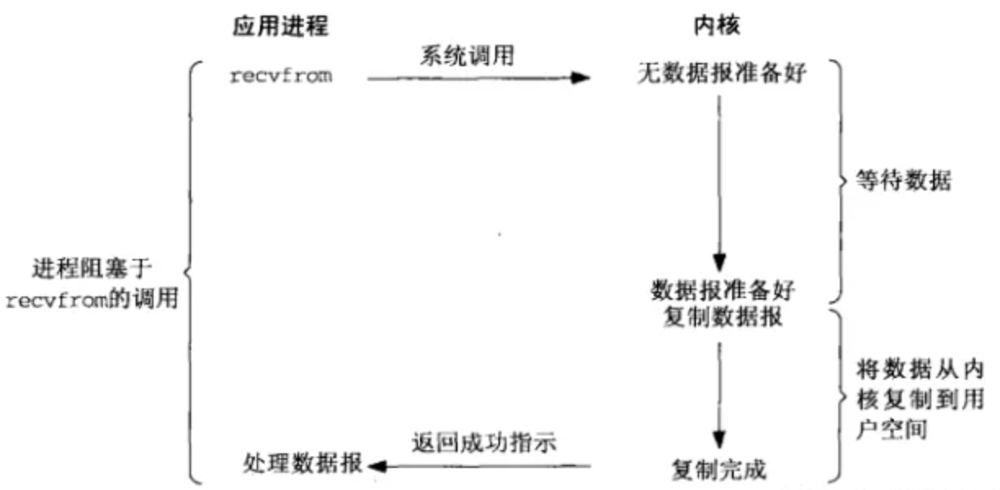
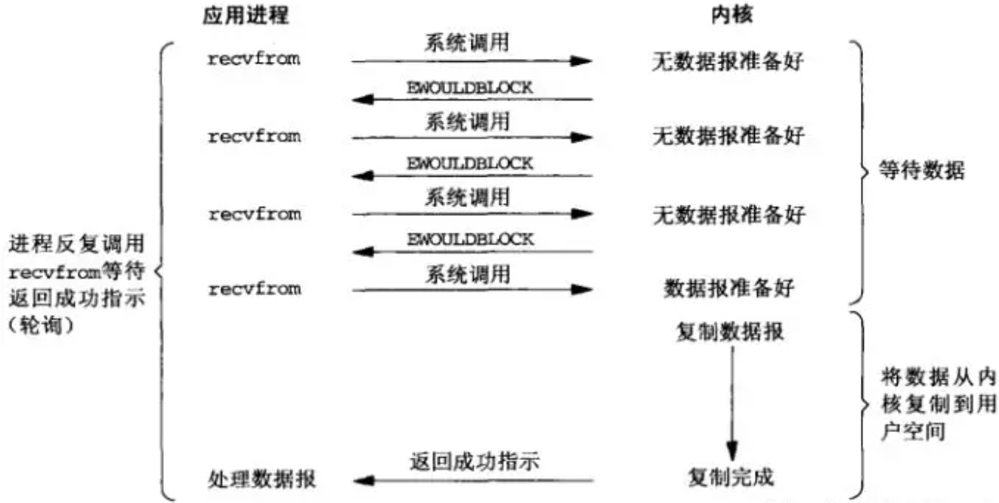
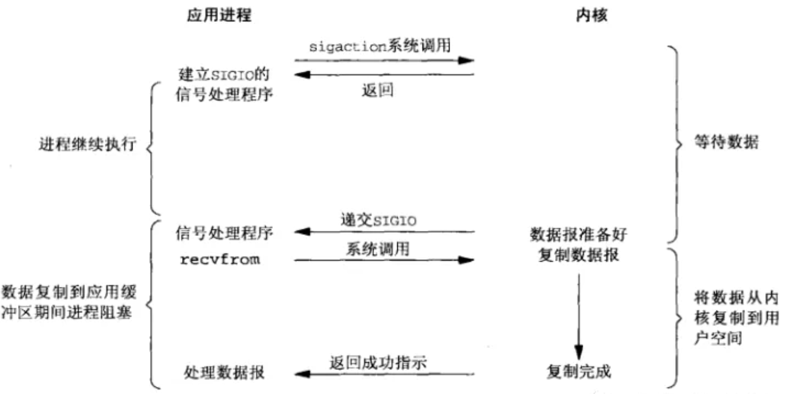
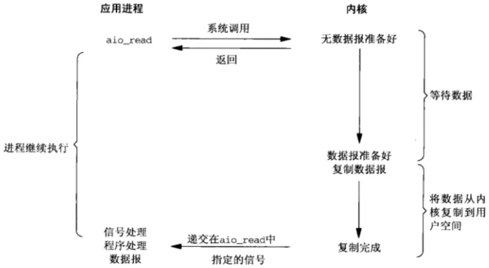
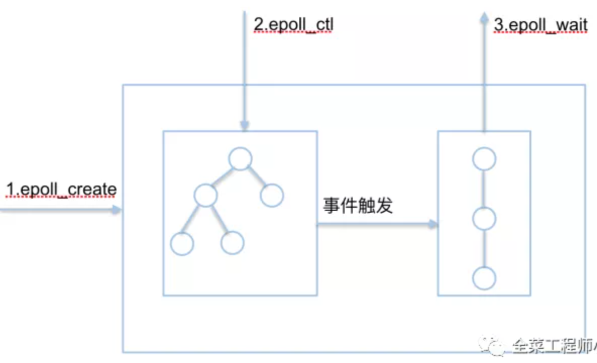
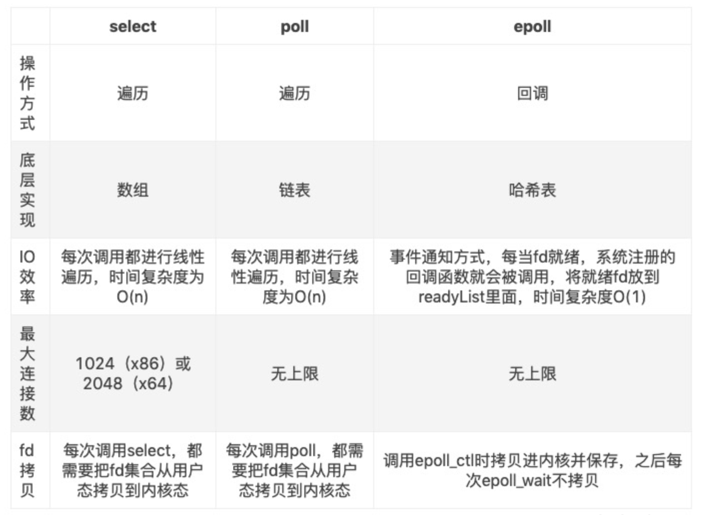

# 基本概念

## 用户空间/内核空间

现代操作系统都是采用虚拟存储器，那么对32位操作系统而言，它的寻址空间（虚拟存储空间）为4G。操作系统的核心是内核，独立于应用程序，可以访问受保护的内存空间，也有访问底层硬件设备的所有权限。为了保护用户进程不能直接操作内核（kernel），保证内核的安全，操作系统将虚拟空间划分为俩部分，一部分为内核空间，一部分为用户空间。

## 同步和异步

同步和异步是针对于用户进程和内核而言的。

- 同步指的是用户进程触发I/O操作并等待或者轮询的去查看I/O操作是否就绪。例如：自己去买衣服，亲自干这件事情，别的事就做不了。
- 异步指的是用户进程触发I/O操作以后便开始做其他的事情，而当I/O操作已经完成的时候会得到I/O完成的通知。例如：告诉朋友你合适衣服的尺寸，颜色，拜托朋友去买，然后去干自己的事，同时，还要告诉朋友你家的衣柜在哪里，方便朋友买完之后将衣服放在你的衣柜（在使用异步I/O时Java将I/O读写委托给OS去处理，需要将数据缓冲区地址和大小传给OS）。

## 阻塞和非阻塞

阻塞和非阻塞是针对用户进程在访问数据的时候，根据I/O操作的就绪状态采取的不同方式。

- 阻塞指的是试图对该文件描述符读写时，如果当时没有东西可读，或者暂时不可写，程序就进入等待状态，直到有东西可读或者可写为止。去地铁站充值，发现这个时候充值员碰巧不在，然后我们就在原地等待，一直等到充值员回来为止。

- 非阻塞指的是如果没有东西可读，或者不可写，读写函数马上返回，而不会等待。在银行里办业务时，领取一张小票，之后我们可以玩手机，或与别人聊聊天，当轮到我们时，银行的喇叭会通知，这时候我们就可以去办业务了。

## I/O模型分类

应用程序向操作系统发出I/O请求：应用程序发出I/O请求给操作系统内核，操作系统内核需要等待数据就绪，这里的数据可能来自于其他的应用程序或者网络。一般来说，一个I/O分为俩个阶段：

1. 等待数据：数据可能来自于其他的应用程序和网络，如果没有数据，应用程序就阻塞等待。
2. 拷贝数据：将就绪的数据拷贝到应用程序工作区。

注：在Linux系统中，操作系统的I/O操作是一个系统调用recvfrom()。

### 同步阻塞I/O

在此种方式下，用户进程发起一个I/O操作以后，必须等待I/O操作的完成，只有当I/O操作完成以后，用户进程才能运行。



### 同步非阻塞I/O

在此种方式下，用户进程发起一个I/O操作后可返回做其他的事情，但是用户进程需要时不时的询问I/O操作是否准备就绪，这就要求用户进程不停的去询问，这引起了CPU不必要的资源浪费。



### 多路复用I/O（重点）

多路复用I/O实际上就是同步阻塞I/O里面加了select,poll,epoll这些函数，所以归根结底，它还是属于同步阻塞I/O，有时也称这种方式为事件驱动I/O。select/poll/epoll的好处在于单个进程就同时处理多个网络连接的I/O，后面会对这三个函数进行比较。

在多路复用中，通过select函数可以同时监听多个I/O请求的内核操作，只要有任意一个I/O的内核操作就绪，就可以通过select返回，再进行系统调用recvfrom（）完成I/O操作。这个过程应用程序就可以同时监听多个I/O请求，这比基于多线程阻塞式I/O要先进不少，因为服务器只需要少量线程就可以进行大量的客户端通信。

.png)

### 信号驱动式I/O

在unix系统中，应用程序发起I/O请求时，可以给I/O请求注册一个信号函数，请求立即返回，操作系统底层则处于等待状态（等待数据就绪），直到数据就绪，然后通过信号通知主调程序，主调程序才去调用系统函数recvfrom（）完成I/O操作。

信号驱动I/O也是一种非阻塞式的I/O模型，比起上面的非阻塞式I/O模型，信号驱动I/O模型不需要轮询检查底层I/O数据是否就绪，而是被动接收信号，然后调用recvfrom（）执行I/O操作。比起多路复用I/O来说，信号驱动I/O模型针对的是一个I/O完成过程，而多路复用I/O模型针对的是多个I/O同时进行时候的场景。



### 异步I/O

在这种模式下，将整个I/O操作（包括等待数据就绪，复制数据到应用进程工作空间）全部交给操作系统完成。数据就绪后操作系统将数据拷贝进应用程序运行的工作空间以后，操作系统再通知应用程序，这个过程中应用程序不需要阻塞。



阻塞，非阻塞，多路复用I/O，都是同步I/O，异步必定是非阻塞的，所以不存在异步阻塞或非阻塞的说法。真正的异步I/O需要CPU的深度参与，换句话说，只有用户线程在操作I/O时根本不用管I/O的执行，这些全部交给CPU去做，用户进程只需要等待一个完成的信号的时候，这才是真正的异步I/O。所以fork子线程去轮询或者使用select,poll,epoll都不是异步。

# 三种I/O多路复用的函数介绍

I/O多路复用就是我们所说的select，poll，epoll。select/epoll的好处在于单个进程（process）就可以同时处理多个网络连接的I/O。它的原理就是select，poll这俩个function会不断的轮询所负责的所有socket，当某个socket有数据到达了，就通知用户进程。

I/O多路复用的特点是通过一种机制一个进程（process）能同时等待多个文件描述符，而这些文件描述符（套接字描述符）其中的任意一个读/写就绪状态，select（）函数就可以返回。I/O多路复用和阻塞I/O其实并没有太大的不同，事实上还更差一些，因为这里需要使用俩个system call（select 和 recvfrom），而阻塞I/O只调用了一个system call（recvfrom）。select/epoll的优势并不是对于单个连接能处理的更快，而是在于能处理更多的连接。

## select

### 【select 函数】

### int select(int maxfdp1,fd_set *readset,fd_set *writeset,fd_set *exceptset,const struct timeval *timeout)

【参数说明】

int maxfdp1：指定待测试的文件描述符的个数，它的值是待测试的最大描述字加1。

fd_set：可以理解为一个集合，这个集合中存放的是文件描述符（file descriptor），即文件句柄。中间的三个参数指定我们要让内核测试读，写和异常条件的文件描述符集合，如果对某一个条件不感兴趣，就可以把它设置为空指针。

timeout：告知内核等待所指定文件描述符集合中有任何一个就绪可花多长事件，timeval结构用于指定这段事件的秒数和微秒数。

返回值：int类型，若有就绪描述符返回其数目，若超时则返回为0，若出错则返回为-1。

### select运行机制

select()的机制中提供一种fd_set的数据结构，实际上是一个long类型的数组，每一个数组元素都能与一个打开的文件句柄（不管是socket句柄还是其他文件或命名管道或者设备句柄）建立联系，建立联系的工作由程序员来完成，当调用select（）时，由内核根据I/O状态修改fd_set的内容，由此来通知执行了select（）的进行哪一个socket或者文件可读。

从流程上来看，使用select函数进行I/O请求和同步阻塞模型并没有什么太大的区别，甚至还多了添加监视socket，以及调用select函数的额外操作，效率更差。但是，使用select以后最大的优势就是用户可以在一个线程上同时处理多个select的I/O请求。用户可以注册多个socket，然后不断地调用select读取被激活的socket，即可达到在同一个线程内同时处理多个I/O请求的目的，而在同步阻塞模型当中，需要通过多线程的方式才能达到这个目的。

### select机制问题

每次调用select，都需要把fd_set集合从用户态拷贝到内核态，如果fd_set集合很大时，那这个开销也是很大的，同时每次调用select都需要在内核遍历传进来的所有fd_set，如果fd_set集合很大时，那这个开销也很大，为了减少数据拷贝带来的性能损耗，内核对被监控的fd_set集合大小进行了限制，并且这个是通过宏控制的，大小不可改变（32位机为1024，64位机为2048）。

## poll

poll的机制与select类似，与select在本质上没有多大差别，管理多个描述符也是进行轮询，根据描述符的状态进行处理，但是poll没有最大文件描述符的限制。

### 【poll 函数】int poll(struct pollfd *fds,nfds_t nfds,int timeout)

```C++
typedef struct pollfd{
	int fd;           //需要被检测或选择的文件描述符
	short events;     //对文件描述符fd上感兴趣的事件
	short revents;    //文件描述符fd上当前实际发生的事件
}pollfd_t;
```

poll改变了文件描述符集合的描述方式，使用了pollfd结构而不是fd_set结构，使得poll支持的文件描述集合限制远远大于select的1024/2048。

【参数说明】

fds：是一个struct pollfd类型的数组，用于存放需要检测其状态的socket描述符，并且调用poll函数以后fds数组不会被清空；一个pollfd结构体表示一个被监视的文件描述符，通过传递fds指示poll（）监视多个文件描述符。其中，结构体的events域是监视文件描述符的事件掩码，由用户来设置这个域，结构体的revents域是文件描述符的操作结果事件掩码，内核在调用返回时设置这个域。

nfds：记录数组fds描述符的总数量。

返回值：int类型，函数返回fds集合中就绪的读写或出错的描述符数量，返回0表示超时，返回-1表示出错。

## epoll

### 概念介绍

epoll是一种I/O事件通知机制，是Liunx内核实现I/O多路复用的一个实现。I/O多路复用是指，在一个操作系统里同时监听多个输入输出源，在其中一个或多个输入输出源可用的时候返回，然后对其进行读写操作。输入输出（input/output）的对象可以是文件（file），网络（socket）,进程间的管道（pipe）等，在Linux系统中这些都用文件描述符（fd）来表示。

epoll的通俗解释是当一种文件描述符的内核缓冲区非空的时候，发出可读信号进行通知，当写缓冲区不满的时候，发出可写信号进行通知的机制。所谓通知机制就是当事件发生的时候，就主动通知，通知机制的反面就是轮询机制。

### 事件

- 可读事件：当文件描述符关联的内核读缓冲区可读，则触发可读事件。（可读：内核缓冲区非空，有数据可以读取）
- 可写事件：当文件描述符关联的内核写缓冲区可写，则触发可写事件。（可写：内核缓冲区不满，有空闲空间可以写入）

### epoll的API详解

epoll的核心是3个API，核心的数据结构是：1个红黑树和1个链表



#### 1.int epoll_creat(int size)

功能：内核会产生一个epoll实例数据结构并返回一个文件描述符，这个特殊的文件描述符就是epoll实例的句柄，后面的俩个接口都以它为中心（即epfd形参）。

size参数表示所要监视文件描述符的最大值，在Linux的版本中已经弃用（同时size不要传0，会报invalid argument错误）

#### 2.int epoll_ctl(int epfd,int op,int fd,struct epoll_event *event)

功能：将被监听的描述符添加到红黑树或者从红黑树中删除或者对监听事件进行修改。对于需要监视的文件描述符集合，epoll_ctl对红黑树进行管理，红黑树中的每个成员由描述符值和所要监控的文件描述符指向的文件表项的引用等组成。

```
op参数说明操作类型：
EPOLL_CTL_ADD：向interest list添加一个需要监视的描述符
EPOLL_CTL_DEL：从interest list中删除一个描述符
EPOLL_CTL_MOD：修改interest list中一个描述符
```

```c++
typedef union epoll_data {
    void *ptr; /* 指向用户自定义数据 */
    int fd; /* 注册的文件描述符 */
    uint32_t u32; /* 32-bit integer */
    uint64_t u64; /* 64-bit integer */
} epoll_data_t;

struct epoll_event {
    uint32_t events; /* 描述epoll事件 */
    epoll_data_t data; /* 见上面的结构体 */
};
```

struct epoll_event结构描述一个文件描述符的epoll行为。在使用epoll_wait函数返回处于ready状态的描述符列表时，

- data域是唯一能给出描述符信息的字段，所以在调用epoll_ctl加入一个需要监测的描述符时，一定要在此域写入描述符相关信息
- events域是bit mask，描述一组epoll事件，在epoll_ctl调用中解释为：描述符所期望的epoll事件，可多选。

常用的epoll事件描述如下：

- EPOLLIN：描述符处于可读状态
- EPOLLOUT：描述符处于可写状态
- EPOLLET：将epoll event通知模式设置成edge triggered
- EPOLLONESHOT：第一次进行通知，之后不再监测
- EPOLLHUP：本端描述符产生一个挂断事件，默认监测事件
- EPOLLRDHUP：对端描述符产生一个挂断事件
- EPOLLPRI：由带外数据触发
- EPOLLERR：描述符产生错误时触发，默认检测事件

#### 3.int epoll_wait(int epfd,struct epoll_event *events,int maxevents,int timeout)

功能：1）阻塞等待注册事件发生，返回事件的数目，并将触发的事件写入events数组中去；2）events：用来记录被触发的events，其大小应该和maxevents一致；3）maxevents：返回的events的最大个数

处于ready状态的那些文件描述符会被复制进ready list中，epoll_wait用于向用户进程返回ready list。events和maxevents俩个参数描述一个由用户分配的struct epoll events数组，调用返回时，内核将ready list复制到这个数组中，并将实际复制的个数作为返回值。注意：如果ready list比maxevents长，则只需要复制前maxevents个成员；反之，则能够完全复制ready list。另外，struct epoll event结构中的events域在这里解释为：在被监听的文件描述符上实际发生的事件。

参数timeout描述在函数调用中阻塞时间上限，单位是ms：

- timeout = -1表示调用将一直阻塞，直到有文件描述符进入ready状态或者捕获到信号才返回；
- timeout = 0用于非阻塞检测是否有描述符处于ready状态，不管结果怎么样，调用都立即返回；
- timeout > 0表示调用将最多持续timeout时间，如果期间有检测对象变为ready状态或者捕获到信号则返回，否则直到超时。

### epoll的俩种触发方式

epoll监控多个文件描述符的I/O事件，eoll支持边缘触发（edge triger，ET）和水平触发（level trigger,LT），通过epoll_wait等待I/O事件，如果当前没有可用的事件则阻塞调用线程。

```
select和poll都只支持LT工作模式，epoll的默认工作模式为LT模式。
```

#### 1.水平触发机制

- 对于读操作，只要缓冲区内容不为空，LT模式返回读就绪；
- 对于写操作，只要缓冲区还不满，LT模式就会返回写就绪；

当被监控的文件描述符上有可读写事件发生时，epoll_wait()会通知处理程序去读写。如果这次没有把数据一次性全部读写完(如读写缓冲区太小)，那么下次调用 epoll_wait()时，它还会通知你在上次没读写完的文件描述符上继续读写，当然如果你一直不去读写，它会一直通知你。如果系统中有大量你不需要读写的就绪文件描述符，而它们每次都会返回，这样会大大降低处理程序检索自己关心的就绪文件描述符的效率。

#### 2.边缘触发机制

对于读操作：

- 当缓冲区由不可读变为可读的时候，即缓冲区由空变为不空的时候；
- 当有新数据到达时，即缓冲区的待读数据变多的时候；
- 当缓冲区有数据可读，且应用进程对响应的文件描述符进行EPOLL_ETL_MOD修改EPOLLOUT的时候。

对于写操作：

- 当缓冲区由不可写变为可写时；
- 当有旧数据被送走，即缓冲区的内容变少的时候；
- 当缓冲区有空间可写，且应用进程对相应的描述符进行EPOLL_CTL_MOD修改EPOLLOUT的时候。

当被监控的文件描述符上有可读写事件发生时，epoll_wait()会通知处理程序去读写。如果这次没有把数据全部读写完(如读写缓冲区太小)，那么下次调用epoll_wait()时，它不会通知你，也就是它只会通知你一次，直到该文件描述符上出现第二次可读写事件才会通知你。这种模式比水平触发效率高，系统不会充斥大量你不关心的就绪文件描述符。

# epoll与select，poll的对比

## 1.用户态将文件描述符传入内核态的方式

- select：创建3个文件描述符集并拷贝到内核中，分别监听读，写和异常动作。这里收到单个进程可以打开的fd数量限制，默认为1024。
- poll：将传入的struct pollfd结构体数组拷贝进内核中进行监听。
- epoll：执行epoll_creat会在内核的告诉cache区中建立一颗红黑树以及就绪链表（该链表存储已经就绪的文件描述符）。接着用户执行epoll_stl函数添加文件描述符会在红黑树上增加相应的结点。

## 2.内核态检测文件描述符读写状态的方式

- select：采用轮询方式，遍历所有的fd，最后返回一个描述符读写操作是否就绪的mask掩码，根据这个掩码给fd_set赋值。
- poll：同样采用轮询机制，查询每一个fd的状态，如果就绪则在等待队列中加入一项并继续遍历。
- epoll：采用回调机制，在执行epoll_stl的add操作时，不仅将文件描述符放到红黑树上，而且也注册了回调函数，内核在检测到某文件描述符可读/可写时会调用回调函数，该回调函数将文件描述符放在就绪链表中。

## 3.找到就绪的文件描述符并传递给用户态的方式

- select：之前传入的fd_set拷贝传出到用户态并返回就绪的文件描述符总数，用户态不知道是哪些文件描述符处于就绪态，需要遍历来判断。
- poll：将之前传入的fd数组拷贝传出用户态并返回就绪的文件描述符总数，用户态并不知道哪些文件描述符处于就绪态，需要遍历来判断。
- 二poll：epoll_wait只用观察就绪链表中有无数据即可，最后将链表的数据返回给数组，并返回就绪的数量。内核将就绪的文件描述符放在传入的数组里，所以只用遍历依次处理即可。这里返回的文件描述符是通过mmap让内核和用户空间共享同一块内存实现传递的，减少了不必要的拷贝。

## 4.重复监听的方式

- select：将新的监听文件描述符集合拷贝传入内核，继续以上步骤。
- poll：将新的struct pollfd结构体数组拷贝传入内核，继续以上步骤。
- epoll：无需重新构建红黑树，直接沿用已存在的即可。

## epoll更高效的原因

- select和poll的动作基本一致，只是poll采用链表来进行文件描述符的存储，而select采用fd标志位来存放，select会受到最大连接数的限制，而poll不会。
- select，poll，epoll虽然都会返回就绪的文件描述符的数量，但是select和poll并不会明确指出那些文件描述符就绪，而epoll会。造成的区别就是，系统调用返回后，调用select和poll的程序需要遍历监听整个文件描述符找到谁处于就绪，而epoll则直接处理即可。
- select，poll都需要将有关的文件描述符的数据结构拷贝进内核，最后再拷贝出来。而epoll创建的有关文件描述符的数据结构本身就存储在内核态中，系统调用返回mmap（）文件映射内存加速与内核空间的消息传递：即epoll使用mmap（）减少复制开销。
- select，poll采用轮询的方式检查文件描述符是否处于就绪状态，而epoll采用回调机制。造成的结果就是，随着fd的增加，select和poll的效率会线性降低，而epoll不会受太大影响，除非活跃的socket很多。
- epoll的边缘触发模式效率高，系统不会排斥大量不关心的就绪的文件描述符。

注：虽然epoll性能最好，但是在连接数少并且连接都很活跃的情况下，select和poll的性能可能比epoll强，毕竟epoll的通知机制需要很多函数回调。



