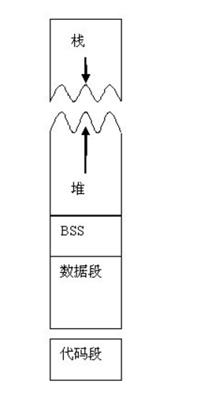
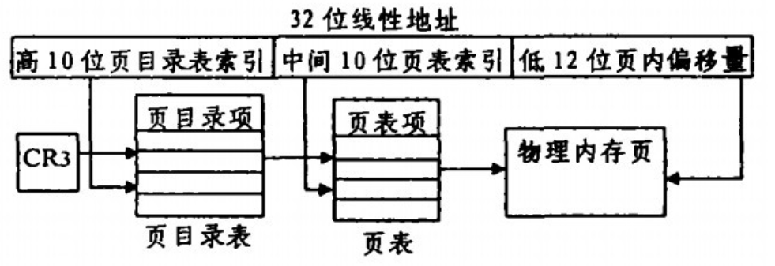
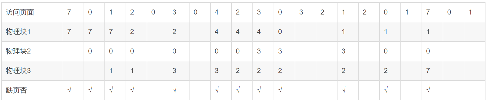
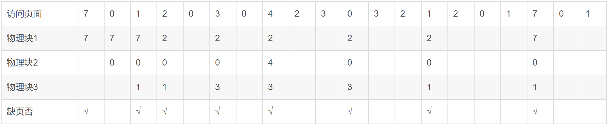

# 一、Liunx进程在内存的数据结构

## 1.存储阶段（未调入内存）

一个可执行的程序（进程）在存储时（未调入内存）分为代码段，数据区和未初始化数据区。

代码段：存放CPU执行的机器指令的一块内存区域，这部分区域的大小在程序运行前就已经确定，并且该区域属于只读，在代码段中可能包含一些只读的常量字符串。

数据段（data段）：存放已经初始化的全局变量，静态变量（包括全局和局部）。

未初始化数据段（bss段）：用来存放程序中未初始化的全局变量和静态变量的一块内存区域。bss段的数据在程序开始执行之前被初始化为0或NULL。bss段属于静态分配，程序结束后静态变量资源由系统自动释放。

注：代码段在地址空间最低，往上依次是data区和bss区。

## 2.运行阶段

程序（进程）在运行阶段有多出俩个区域：堆区和栈区。

堆区：用于动态分配内存，位于bss段和栈区之间。由程序员申请内存和释放，堆区是从低地址向高地址增长的，采用链式存储结构。频繁的调用malloc/delete会造成内存空间不连续，产生碎片。当申请堆空间时，库函数是按照一定的算法来搜索可用的足够大的空间，因此堆的效率要比栈的低很多。

栈区：由编译器自动释放，存放函数的参数值，局部变量等。每当一个函数被调用时，该函数的返回类型和一些调用的信息将被存放在栈中，接着这个被调用的函数再为它的自动变量和临时变量在栈上分配空间。每调用一个函数，一个新的栈就会被使用。栈区是由高地址向低地址增长的，是一块连续的内存区域，最大容量由系统预先定义好，申请的栈空间超过这个界限就会提示溢出，用户从栈中获取的空间较小。



# 二、地址相关概念

## 1.物理地址

物理内存：真实存在的，插在主板内存槽上的内存条的容量大小。

内存是由若干个存储单元组成的，每个存储单元有一个编号，这种编号可唯一识别一个存储单元，称为内存地址（物理地址）。可以把内存看作是一个从0字节一直到内存最大容量，逐字节编号的存储单元数组，即每个存储单元与内存地址的编号相对应。

## 2.虚拟内存

虚拟内存就是每个进程可以直接寻址的地址空间，不受其他进程干扰。每个指令或者数据单元都在这个虚拟空间中有确定的地址。

虚拟内存：就是进程中的目标代码，数据等的虚拟地址组成的内存空间。

虚拟内存不管物理内存的大小和信息存放的实际位置，只规定进程中相关联信息的相对位置，每个进程都有自己的虚拟内存，且虚拟内存的大小由CPU的寻址方式和地址结构决定。如直接寻址，如果cpu的有效地址长度为16位，则其寻址范围0-64KB。再比如32位机器可以直接寻址4GB空间，意思是每个应用程序都有4GB内存空间可用。但是显然机器内存罕有如此之大，可以支持每个程序使用4G内存的。

虚拟内存和物理内存的区别：虚拟内存与物理内存正相反，是指根据系统需要从硬盘中匀出来的内存空间，是一种计算机系统内存管理技术，属于计算机程序，而物理内存是硬件。有时候系统处理大的程序时内存不够用，系统就会把硬盘当作内存来使用，来交换数据做缓冲区，显然物理内存的处理速度要比虚拟内存快很多。

## 3.逻辑地址

源程序经过编译汇编后形成目标代码，每个目标代码都是以0为基址顺序进行编址的，这样生成的目标程序占据一定的空间，称为作业的逻辑地址空间，也叫做逻辑空间。在逻辑空间中每条指令的地址和指令要访问的操作数的地址统称为逻辑地址，即应用程序中的地址。要经过寻址方式的计算或变换，才能得到物理地址。

逻辑地址就是源程序里面使用的地址，相当于当前段的偏移地址。

## 4.线性地址或虚拟地址（Linux）

线性地址是逻辑地址到物理地址变换之间的中间层。程序代码会产生逻辑地址，或者说是段中的偏移地址，加上相应段的基地址就生成了一个线性地址。如果启用了分页机制，那么线性地址可以再经变换以产生一个物理地址。若没有启用分页机制，那么线性地址直接就是物理地址。

跟逻辑地址类似，线性地址也是一个不真实的地址，如果逻辑地址是对应的硬件平台段式管理转换前地址的话，那么线性地址则对应了硬件页式内存的转换前地址。CPU将一个虚拟内存空间中的地址转换为物理地址，需要进行两步：首先将给定一个逻辑地址（其实是段内偏移量），CPU要利用其段式内存管理单元，先将为个逻辑地址转换成一个线程地址，再利用其页式内存管理单元，转换为最终物理地址。

# 三、地址映射

## 3.1 逻辑地址转换为线性地址

一个逻辑地址有俩部分组成，【段标识符：段内偏移量】,CPU利用其段式内存管理单元，先将逻辑地址转换为线性地址。

段描述符是一个16位长的字段组成，称为段选择符，其中15-3这13位是段选择符，2-0这3位包含了一些硬件细节，如下图所示。


通过段标识符中的索引号从GDT或者LDT中找到该段的段描述符，段描述符中的base字段是段的起始地址，描述了一个段开始位置的线性地址。

注：一些全局的段描述符就放在“全局段描述符表（GDT）”中，GDT在内存中的地址和大小存放在CPU的gdtr控制寄存器中，一些局部的，如每个进程自己的，就放在所谓的“局部段描述符表（LDT）”中，LDT在ldtr寄存器中。

具体步骤：

- 给定一个完整的逻辑地址【段选择符：段内偏移地址】，看段选择符中的TI是1还是0，据此判断是要转换GDT还是LDT中的段，再根据相应寄存器，得到其地址和大小，得到一个数组；
- 取出段选择符中的索引号，在这个给数组中，查找对应的段描述符，得到他的base，即段基地址；
- base+offset（偏移量），就是要转换的线性地址。

## 3.2 线性地址转换为物理地址

Linux的每个进程用户都可以访问4GB的线性地址空间，而实际的物理内存不可能为每个进程分配4GB的内存空间，它没那么大，这时采用分页机制，Linux仅把执行映像的一小部分装入物理内存，当需要访问未装入的界面时，产生缺页中断，把需要的页读入到物理内存。



 Linux采用两级页表结构—— 页目录表和页表实现地址映射。当前正在运行进程的页目录表的地址被保存在控制寄存器 CR3 中。由上面转换机制所得到的线性地址可以分为3个 部分，高10位是 DIR域—— 页目录表的索引值。它与 CR3 中的地址一起计算得到页表的物理地址。中间10位保存相对于页表的索引值，通过它得到所需的物理页号。 物理页号与低12位页内偏移 组合得到物理地址 。

# 四、swap对换空间

32位Linux系统中每个进程有4GB的虚拟内存空间，而且系统中还会存在多个进程，但事实是计算机并没有这么多物理内存空间，当系统中的物理内存紧张时，就需要利用对换空间把一部分未来可能不用的页面从物理内存中移到对换设备或对换文件中。

Linux采用俩种方式来保存换出的页面，一种是利用整个块设备，如硬盘的一个分区，这叫对换设备；另一个就是利用文件系统中固定长度的文件，即对换文件，它们统称为对换空间。

 这两种方式的相同之处是它们的内部格式一致，但是在执行效率方面，对换设备要好一些，这是因为对换设备上同一页面的数据块是连续存放的，故而可以顺序存取，而在对换文件中 ，同一页面的数据块实际的物理位置可能是不连续的，需要通过对换文件的 inode检索， 这就降低了存取效率 。

# 五、分页机制管理

Linux利用分页管理机制来更加有效的利用物理内存，当创建一个进程时，仅仅把当前进程的一小部分装入到内存当中，需要访问其余部分时，处理器产生一个缺页故障，由缺页中断服务程序根据虚拟地址和出错码把需要的页换入内存。随着可执行映像的运行和换入，会导致内存紧张，这时Linux核心就必须调用kswap守护进程释放一部分物理内存，kswap在系统启动时由Init进程建立，在系统的运行过程中，他被定期唤醒，检查内存中空闲的内存是否很少，如果是，则释放一部分内存，或者将一些页面换出到对换空间，然后继续休眠。

```
kswap守护进程负责确保内存保持可用内存空间，它负责监测内核中的page_high和page_low标记，如果可用内存空间值小于page_low时，kswap进程扫描并尝试每次回收32个页面，如此重复知道可用内存空间的值大于page_high。
kswap履行以下操作：
假如页面未改变，它将页面放入空闲链表（free-list）;
假如页面发生改变且被文件系统回写，它将页面内容写入硬盘；
假如页面发生改变，且未被文件系统回写（无名页），它将页面内容写入swap设备。
```

## 缺页中断和页面换入

页面换入主要由缺页中断服务程序来实现，当系统中发生页面故障时，若虚拟地址有效，则产生错误的原因有俩种：

- 虚拟内存地址对应的页不在内存中,那么它必定在磁盘上或对换空间中，调用相应的函数换入页面即可。
- 该虚拟地址对应的页在内存，但被写保护。

## 页交换进程和页面换出

系统使用kswap守护进程用于的定期的换出页面，使系统中有足够的空闲物理内存页。kswap守护进程定期检查系统的空闲内存页，如果小于一定值，则按照如下三途径得到空闲页面：

- 减少缓冲区和页面告诉缓存的大小；
- 把共享内存占用的页面置换到对换空间；
- 换出或丢弃物理页。

# 六、缺页中断具体说明

## 1.缺页中断的定义

现代操作系统通过虚拟内存技术来扩大物理内存，虚拟内存每一页都映射在物理内存或磁盘上，所以虚拟内存要比物理内存大。程序访问的都是虚拟地址，当程序访问映射在磁盘上时，就会发生缺页中断，调用中断处理程序，将页载入物理内存。例如：32位的Linux每个用户进程可以访问4GB的虚拟内存，而实际的物理内存远远小于4GB。采用分页机制，Linux仅把可执行映像的一小部分装入到物理内存，当需要访问未装入的页面时，系统产生一个缺页中断，把需要的页读入物理内存。

缺页中断：指的是应用程序试图访问已映射在虚拟内存空间中，但尚未装入物理内存的分页时，产生一个页不存在中断，需要操作系统将其调入到物理内存后再进行访问。这时，被内存映射的文件（映像），实际成为一个分页交换文件。

## 2.缺页中断次数

中断次数=进程的物理块数+页面置换次数；

缺页中断率=缺页中断次数/总访问页数；

## 3.页面置换算法

当发生页面中断时，如果操作系统中没有空闲页面，则操作系统必须在内存中选择一个页面将其移出内存，以便为即将调入的页面让出空间，而选择淘汰哪一页的算法就叫做页面置换算法。

先假设一个场景，在分页虚拟存储管理的系统中，有一用户进程，它依次要访问的页面序列是序列7, 0, 1, 2, 0, 3, 0, 4, 2, 3, 0, 3, 2, 1, 2, 0, 1, 7, 0, 1。 假定分配给该进程的页数（物理块）为3且进程初始时未装载页面（意思就是进程只能使用三块内存）。 

### 3.1 先进先出（FIFO）

淘汰掉最先进入内存的页，亦即在内存中驻留时间最久的页面。该算法实现也很简单，只需把调入内存的页面根据先后次序接入队列，设置一个指针总指向最早的页面，该算法的思想载入内存的时间越长，该页以后不再使用的概率就越大，但是这个思想往往是有问题的，因为经常有一些程序或数据，在程序的整个生命周期都会被频繁访问，如果采用FIFO算法，这些页将被频繁的换入换出内存。

利用FIFO置换算法时的置换图：


由上图可以看出，FIFO算法发生了15次缺页中断，进行了12次页面置换，还有三次是内存没满，直接载入页面。

### 3.2 最近最少使用算法（LRU）

最近最少使用置换策略认为在过去的一段时间未被访问的页面，在最近一段时间也不会被访问。该算法为每个页面设置一个访问字段，来记录页面自上次访问以来所经历的时间，淘汰页面时选择时间值最大的进行淘汰。LRU的性能接近最佳策略，但是实现起来比较困难。

利用LRU置换算法时的置换图：



由上图可知，LRU发生了12次缺页中断，进行了9次页面置换。

### 3.3 最佳置换算法（OPT）

最佳策略选择下次访问时间距当前时间最长的那一页，该算法可以保证最低的缺页率，但它也是不可能实现的，因为它要求操作系统能准确预知未来的事件，这是无法做到的，这一算法现在作为衡量现实世界中其他算法性能的标准而存在。

利用OPT置换算法时的置换图：



进程运行时，先将7, 0, 1三个页面依次装入内存。进程要访问页面2时，产生缺页中断，根据最佳置换算法，选择第18次访问才需调入的页面7予以淘汰。然后，访问页面0时，因为已在内存中所以不必产生缺页中断。访问页面3时又会根据最佳置换算法将页面1淘汰……依此类推，如图所示。可以看到，发生缺页中断的次数为9，页面置换的次数为6。


