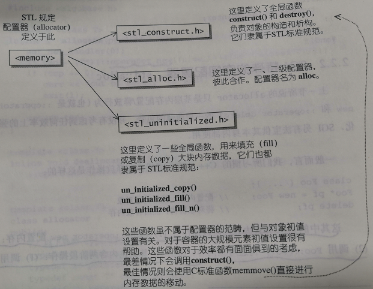
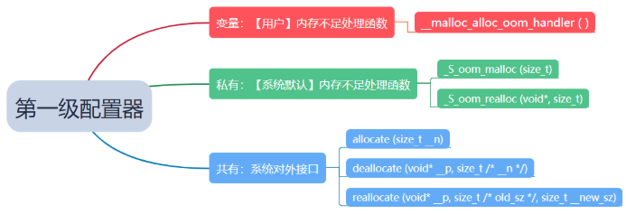
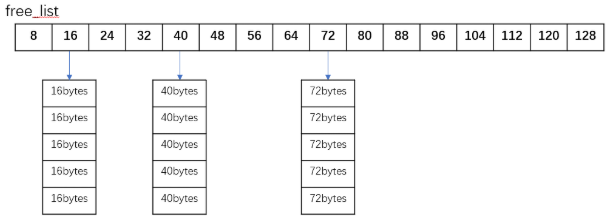
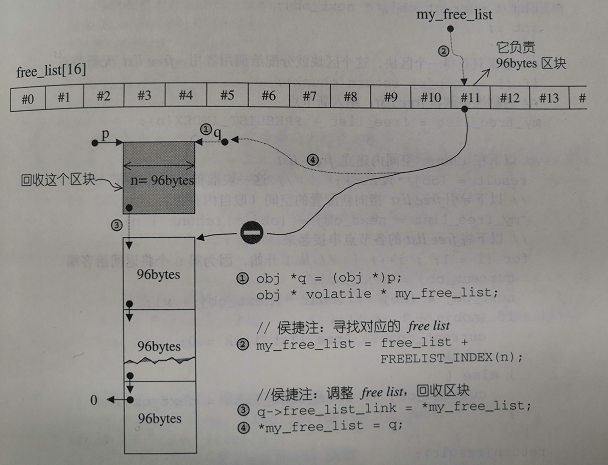

### 前言

之前看完侯捷老师的《STL源码剖析》，对空间配置器那块有点一知半解，这几天又将这一块重新看了一下，对allocator的设计逻辑和源码有了进一步的理解，故写此博客进行记录，谈谈我对空间配置器的理解，不足之处请大家批评指正。

### 什么是空间配置器？

空间配置器隐藏在一切组件（更具体的说是指容器）的背后，默默工作，默默付出，它的主要任务就是为容器配置空间，当然我们所指的空间是指内存，至于为什么不叫内存配置器，是因为空间不仅仅只有内存，也可以是磁盘或者其他辅助存储的介质，你也完全可以设计一个从硬盘中去空间的allocator。

### SGI 标准的空间配置器

SGI STL的配置器与众不同，它的名称为alloc而非alloctor，不接受任何参数。SGI也定义了一个符合部分标准的名叫alloctor的配置器，但SGI不建议他人使用，主要原因是效率不佳，只是对c++的 ::operator new和 ::operator delete做了一层薄薄的包装而已，后面SGI又换回了标准的空间配置器，原因未知。

### SGI 特殊的空间配置器

上面我们谈到的allocator只是基层内存配置/释放行为（也就是 ::operator new()和 ::operator delete()）的一层薄薄的包装，并没有考虑效率上的强化，为此SGI另辟蹊径，设计了一个专供内部使用的std::alloc空间配置器。

在分析std::alloc之前，我们先要清楚C++中new（）和delete（）是怎么工作的。new算式包含俩个阶段的操作，1）调用 ::operator new()配置内存；2）调用构造函数构造对象内容。同样的，delete算式也是内含俩个阶段的操作，1）调用析构函数将对象析构；2）调用 ::operator delete()释放内存。为精明分工，SGI将上述俩函数的俩个步骤拆开，其中内存配置由alloc::allocate()负责，内存释放由alloc::deallocate()负责；对象构造由alloc::construct()负责，对象析构由alloc::destroy()负责。



#### 构造和析构的基本工具：construct()和destroy()

下面对construct()和destroy()源码进行分析

```c++
#include <new.h> //欲使用placement new,需包含此文件
template<class T1,class T2>
inline void construct(T1* p,const T2& value)
{
	new (p) T1(value);  //placement new; 调用T1::T1(value);    
}
```

上述是allco中construct（）的源码，construct（）接受一个指针p和一个初值value，该函数的用途就是将初值设定到指针所指的空间上。乍一看，不还是调用了new吗，有什么区别？这里用到了placement new，它允许你在一个已经分配好的内存中（栈或者堆）构造一个新的对象，原型中的p指针是一个指向已经分配好的内存缓冲区的首地址。

对placement new的理解：首先用::operator new去申请内存，然后再构造对象，注意构造对象所用的内存是已经申请而没有使用的。如果要在一个已知的内存中构造一个对象，直接用new是无法实现的，placement new的作用就是在一块已经分配好的内存中构造一个对象，这个“已分配好的内存”其实是在一块预先准备好的内存缓冲区直接分配，而不需要去查找是否有合适的内存，这样内存分配的时间是常数，其使用方式就像第五行代码，p是一块已经分配好的内存（或者说这块内存命名为p），然后将初值value放入到对象中。也就是说，通过placement new去执行new的第二个阶段。

```c++
// destroy()第一个版本，接受一个指针
template <class T>
inline void destroy(T* pointer) {
    pointer -> ~T();  // 直接调用dtor ~T()
}
// destroy()第二个版本，接受两个迭代器，此函数设法找出元素的数值型别
// 进而利用__type_traits<>求取最适当措施
template <class ForwardIterator>
inline void destroy (ForwardIterator first, ForwardIterator last) {
    __destroy (first, last, value_type(first));
}
template <class ForwardIterator, class T>
inline void __destroy (ForwardIterator first, ForwardIterator last, T*) {
    typedef typename __type_traits<T>::has_trivial_destructor trivial_destructor;
    __destroy_aux (first, last, tricial_destructor());
}
//如果元素的数值型别（value type）有 non-trivial destructor...
template <class ForwardIterator>
inline void __destroy_aux(ForWardIterator first,ForWardIterator last,__false_type){
    for(;first<last;++first)
        destroy(&*first) //&*first是迭代器所指内容的地址，调用destroy析构该内容
}
//如果元素的数值型别（value type）有 trivial destructor...
template <class ForwardIterator>
inline void __destroy_aux(ForWardIterator first,ForWardIterator last,__true_type){}
```

destroy()有俩个版本，第一个版本接受一个指针，准备将所指之物析构调。第二个版本接受first和last俩个迭代器，准备将[first, last)范围内的对象析构掉。

对于第二个版本为何有俩种措施，侯捷老师给出的解释是我们不知道[first,last)这个范围有多大，万一很大，且每个对象的析构函数都无关痛痒（即trivial destructor），那么一次次调用哪些无关痛痒的析构函数是对效率的一种伤害。因此，首先利用value_type()获得迭代器所指对象的型别，再利用__type_traits<T>来判断该析构函数是否无关痛痒。若是（ _ _true _ type）,则什么都不做就结束；若否（ _ _false _ type ），这才以循环的方式巡访整个范围，并在循环中每经历一个对象就调用第一个版本的destroy()。

针对于上段话可以这么理解：所谓的无关紧要指的是用户不定义析构函数，而是系统自带的，则说明析构函数基本没什么用（会调用默认的析构函数），我们称之为travial destructor；反之，如果定义了析构函数，则说明要在释放空间之前做一些事情，则这个析构函数称为non-trivial destructor。因为对于一块很大的内存区域，对其中每个对象都进行析构，是非常不合理的；所以如果此对象，没有自定义析构函数（析构函数是无关痛痒的），就不做任何事；反之则调用析构函数。

详细了解trivial destructor可参见:https://blog.csdn.net/zhiren2011/article/details/38081353

函数.png)

#### 空间的配置和释放 std::alloc

C++内存配置的基本操作是 ::operator new()，内存释放的基本操作是 ::operator delete()，这俩个全局函数相当于C中的malloc() 和 free()，SGI也是以 malloc() 和 free() 完成内存的配置和释放的。

考虑到小型区块所可能造成的内存破碎问题，SGI设计了双层级配置器，第一级配置器直接使用malloc() 和free()，第二级配置器则根据情况采用不同的策略：当配置的区块超过128字节时，视为“足够大”，调用第一级配置器；当配置的区块小于128字节时，视为“过小”，为减轻额外的负担，便采用复杂的内存池（memory pool）整理方式，而不再求助于第一级配置器。

##### 第一级配置器 _ _malloc _ alloc _ template剖析

第一级配置器以malloc()，free()，realloc()等C函数执行实际的内存配置，释放和重配操作，因为SGI是以malloc而非 ::operator new来配置内存的，所以它不能直接使用C++的new-handler机制，要实现类似的C++ new-handler机制（所谓的C++ new-handler机制是指你可以要求系统在内存配置需求无法被满足时，调用一个你所指定的函数）。

SGI的第一级配置器 allocate() 和 realloc() 都是在调用 malloc() 和 realloc() 不成功后，改调用 oom_malloc() 或者oom_realloc() 来处理，后面俩者都有内循环，不断调用“内存不足处理例程”，期望在某次调用之后，获得足够的内存而圆满完成任务，最后返回分配到的内存。注意若“内存不足处理例程”未被客端定义，则oom_malloc()  和oom_realloc() 会调用__THROW _ BAD _ ALLOC 丢出 bad _ alloc 异常信息，或利用exit(1)硬生生终止程序。

```c++
template <int inst>
class __malloc_alloc_template {
private:
    // 以下函数将用来处理内存不足的情况
    // oom: out of memory
    static void *oom_malloc(size_t);
    static void *oom_realloc(void *, size_t);
    static void (* __malloc_alloc_oom_handler)();
    public:
    static void *allocate(size_t n) 
    {
        void *result = malloc(n);//第一级配置器直接调用malloc()
        if (0 == result) result = oom_malloc();
        return result;
    }	
    static void deallocate(void *p, size_t /* n */) 
    {
        free(p);//第一级配置器直接调用free()
    }
    static void *reallocate(void *p, size_t /*old_sz */, size_t new_sz) 
    {
        void *result = realloc(p, new_sz);//第一级配置器直接调用realloc()
        if (0 == result) result = oom_realloc();
        return result;
    }
    //下面仿真C++ 的set_new_handler(),换句话说，你可以通过它调用你自己的out-of-memory handler
    //这个函数功能是重新设置内存不足处理函数。它接收一个函数指针，这个函数指针由用户自己定义
    //传进来之后，赋值给变量__malloc_alloc_oom_handler
    static void(* set_malloc_handler(void (*f)()))()
    {
        void (* old)()=__malloc_alloc_oom_handler;
        __malloc_alloc_oom_handler=f;
        return (old);
    }
    
}
```



##### 第二级配置器 __default _ alloc _ template 剖析

SGI第二级配置器的做法是，如果区块够大，超过128字节，则交给第一级配置器去处理；当区块小于128字节，则用内存池（memory pool）管理，此法称之为次层配置：每次配置一大块内存，并维护对应之自由链表（free- list）。若下次再有相同大小的内存需求，就直接从free-list中拨出，如果客端释还小额区块，就由配置器回收到free-list中（配置器除了负责配置，也负责回收）。

第二级配置器维护的自由链表是一个由16个链表头指针组成的向量，每个链表节点维护一串内存区域，从下标0开始，管理的内存大小依次是8,16,24，...... 一直到下标为15管理的128字节。二配会主动将任何小额区块的内存需求量上调至8的倍数（例如客端要求30bytes，就自动调整为32bytes）。



free_list是一个指针数组，数组里面的每个元素都是一个_obj类型的指针变量，free-list的节点结构如下：

```c++
union obj 
{
    union obj * free_list_link;
    char client_data[1];
}
```

第一个字段：视为一个指针，指向相同形式的另一个obj

第二个字段：视为一个指针，指向实际区块

注：union是一个特殊的类，类内可以定义多个不同类型的数据成员，类内的所有数据成员共享一块内存，内存大小为数据类型最大的那个，并且任意时刻，union中只能有一个数据成员可以有值，也就是说当给union中的某个数据成员赋值后，其他的数据成员就会变为未定义状态。

union详见：https://blog.csdn.net/hou09tian/article/details/80816445

SGI正式利用这种方式做到一物二用，用一块空间来维护俩个链表，下面是第二级配置器的部分实现内容。

```c++
enum {__ALIGN = 8}; // 小型区块的上调边界
enum {__MAX_BYTES = 128}; // 小型区块的上界
enum {__NFREELISTS = __MAX_BYTES / __ALIGN}; // free_list个数

template <bool threads, int inst>
class __default_alloc_template 
{
private:
    static size_t ROUND_UP(size_t bytes);  // 上调函数，上调至8的倍数
    union obj{...};  // free_list结构
    static obj * volatile free_list[__NFREELISTS]; // 构造一个free_list
    static size_t FREELIST_INDEX(size_t bytes){...};  // 根据bytes获得对应的索引
    static void *refill(size_t n);  // 为free_list重新填充空间
    static char *chunk_alloc(size_t size, int &nobjs);  // 配置一大块空间
    static char *start_free;  // 内存池起始位置
    static char *end_free;  // 内存池结束位置
    static size_t heap_size;  // heap(堆)空间大小
public:
    static void *allocate(size_t n);  // 空间配置函数
    static void deallocate(void *p, size_t n);  // 空间释放函数
    static void *reallocate(void *p, size_t old_sz, size_t new_sz);  // 空间配置函数
}
```

- 空间配置函数allocate()

此函数首先判断区块大小，大于128bytes就调用第一级配置器，小于128bytes就检查对应的free-list，如果free-list有可用的区块，就将第一个可用的区块拿来用，此时result指向my_free_list，调整my_free_list指向result的下一个区块，其实就是把要用的那个链表节点给删掉；如果没有可用区块就将区块大小上调至8倍数的边界，然后调用refill()，准备为free-list重新填充空间。

```c++
static void *allocate(size_t n) 
{
    obj * volatile * my_free_list;
    obj * result;
    // 大于128bytes调用第一级配置器
    if (n > (size_t) __MAX_BYTES) {
        return (malloc_alloc::allocate(n));
    }
    // 寻找16个free_list适当的一个
    my_free_list = free_list + FREELIST_INDEX(n);
    result = *my_free_list;
    // 如果没有可用的区块，调用refill重新填充
    if (result == 0) {
        void *r = refill(ROUND_UO(n));
        return r;
    }
    // 调整free_list
    *my_free_list = result->free_list_link;
    return result;
}
```

.png)

如果没有可用的区块，就要调用refill()重新填充。refill() 的作用主要在于重新调整填充free-list，新的空间将取自于内存池（经由chunk-allocate（）完成），缺省取20个新节点（新区块），但万一内存池空间不足，获得的节点数（区块数）可能小于20。

```c++
template <bool threads, int inst>
void* __default_alloc_template<thread, inst>::refill(size_t n) 
{
    int nobjs = 20;  // 默认填充20个区块
    char * chunk = chunk_alloc(n, nobjs);  // 调用chunk_alloc尝试获取nobjs个大小为n的区块
    obj * volatile * my_free_list;
    obj * result;
    obj * current_obj, * next_obj;
    int i;
    //如果只获得一个快去，则直接就分配给调用者，free-list无新节点
    if (1 == nobjs) return (chunk); 
    // 否则准备调整free list，纳入新节点，首先找到n对应的free_list
    my_free_list = free_list + FREELIST_INDEX(n);  
    // 这一块配置给调用者
    result = (obj *)chunk; 
    //纳入剩下的（nobjs-1）个区块，这些是取自内存池的
    *my_free_list = next_obj = (obj *)(chunk + n);
    //从1开始，第0个已经交给客端
    for (i = 1; ; i++) 
    {
        current_obj = next_obj;
        // 因为每个区块大小为n，所以下一个区块地址就是前一个区块加上n
        next_obj = (obj *)((char *)next_obj + n);  
        if (nobjs - 1 == i) 
        {
            // 到结尾了，当前区块的next指向0，结束循环
            current_obj->free_list_link = 0;
            break;
        }
        // 否则就指向next_obj
        else current_obj->free_list_link = next_obj;
    }
    return (result);
}

```

从内存池中取空间给free list 是chunk_alloc()  的工作，对于chunk_alloc() 获取到的区块无外乎就三种情况：1）没有获取到区块，这时chunk_alloc内部会做异常处理。2）只获取到一个区块，那么就直接将这个区块拿给客端去用；3）获取到多个区块，除了将第一个区块拿去用，其余的区块就要接到对应的my_free_list之后，以备下次使用。

```c++
template <bool thread, int inst>
char* __default_alloc_template<thread, inst>::chunk_alloc(size_t size, int& nobjs) 
{
    char * result;
    size_t total_bytes = size * nobjs;  // 总共需要获取的空间大小
    size_t bytes_left = end_free - start_free;  // 内存池剩余的空间大小
    // 如果内存池剩余的空间大于需求，那么就直接将start_free返回，并且调整start_free
    if (bytes_left >= total_bytes) 
    {
        result = start_free;
        start_free += total_bytes;
        return (result);
    }
    // 如果内存池剩余的空间没有total_bytes那么大，但至少还有一个区块的大小
    // 改变nobjs的值，以获得剩余的空间
    else if (bytes_left >= size) 
    {
        nobjs = bytes_left / size;
        total_bytes = size * nobjs;
        result = start_free;
        start_free += total_bytes;
        return (result);
    }
    // 如果只有小于一个区间大小的空间
    else 
    {
        // bytes_to_get是为了调用malloc申请更大的空间
        size_t bytes_to_get = 2 * total_bytes + ROUND_UP(heap->size >> 4);
        // 将仅剩的空间“碎片利用”，分到对应的free_list
        if (bytes_left > 0) 
        {
            obj * volatile * my_free_list = free_list + FREELIST_INDEX(bytes_left);
            ((obj *)start_free) -> free_list_link = *my_free_list;
            *my_free_list = (obj *)start_free;
        }
    }
    // 配置heap空间，用来补充内存池
    start_free = (char *)malloc(bytes_to_get);
    // 后续的代码不做分析
    ...
}
```

上面的chunk_alloc（）函数以 end _free -start _ free来判断内存池的水量。如果水量充足，就直接调出20个区块返回给free-list，如果水量不足，但仍可以供应一个及以上的区块，就将这不足20个区块的空间拨出去，这时的nobjs参数将被修改为实际能够供应的区块数。如果内存池连一个区块空间都无法供应，对客端显然无法交代，此时需要利用malloc() 从heap中配置内存，为内存池注入源头活水以应对需求。新水量的大小为需求量的俩倍，再加上一个随着配置次数增加而愈来愈大的附加量。万一山穷水尽，整个system heap空间都不够了（以至于无法向内存池中注入源头活水），malloc（）行动失败，chunk_alloc()就四下寻找看看有无“尚未用区块，且足够大”指free list，找到就挖出一块使用，找不到就调用第一级配置器。第一级配置器其实也是调用 malloc() 来配置内存，但它有out-of-memory处理机制，或许有机会释放其他的内存拿来此处使用，如果可以就成功，否则发出bad_alloc异常。

举个例子说明一下内存分配的整个过程。假设现在我需要一块大小为36bytes的空间，首先根据需求空间的大小得到free_list对应区块所在的索引，为了方便管理，第二级配置器会自动将需求大小上调至最近的8的倍数，这里上调至40bytes，这样就能够得到索引4；根据索引可以找到对应区块的地址，然后查看是否还有空闲的区块，如果有就将该区块分配给该对象，如果没有空闲区块了，那么就需要从剩余的内存池中申请一块内存，将其分解至大小为40bytes的小区块，将第一块分配给对象，剩余的区块就连接至对应的free_list中（也就是索引4的位置）；如果内存池都没有空闲的内存了，就调用malloc()从heap中配置内存，为内存池活水，配置内存的大小为需求量的俩倍（这里是40bytes*40），加上一个随着配置次数增加而愈来愈大的附加量（ROUND_UP(heap->size >> 4)）；万一系统堆也没有足够的内存，chunk_alloc()就四下寻找看看有无“尚未用区块，且足够大”的free list（这里指大于40bytes的free list），找到就挖出一块使用，找不到就调用第一级配置器来配置内存；最极端的状态，如果第一级配置器都不能够配置多余的内存了，说明内存已经满了，那么就会调用out-of-memory处理机制或者看看能不能释放其他内存拿来此处使用。

```c++
//p不可以是0
static void deallocate(void *p, size_t n) 
{
    obj * volatile * my_free_list;
    obj *q = (obj *)p;
    if (n > (size_t) __MAX_BYTES) {
        malloc_alloc::deallocate(p, n);
        return;
    }
    //寻找对应的free list
    my_free_list = free_list + FREELIST_INDEX(n);
    //调整free list，回收区块
    q -> free_list_link = *my_free_list;
    *my_free_list = q;
}
```

二级配置器拥有标准的接口函数deallocate() 。该函数首先判断区块的大小，大于128字节就调用一级配置器，小于128字节就找出对应的free list，将区块回收，可将其看作是某一数组元素所在链表的头部插入操作。 



### 总结

本文较为详细的分析了SGI STL设计的空间配置器，从包含对象内容构造析构的<stl_construct.h>，到包含内存空间配置与释放的释放的<stl_alloc.h>，着重分析了里面的四个函数，对内存分配有了进一步的认识，最后感谢侯捷老师的《STL源码分析》，该书对STL的底层实现分析相当到位，是学习C++标准库的一本经典书籍。