###  前言

看了谢希仁的计算机网络，并结合相关博客对TCP/IP协议簇有了较为详细的了解，因知识点繁多，故写此博客进行梳理总结。在进行正式总结前，我想先谈一谈为什么会有TCP/IP协议。世界上的各种各样的电脑运行着多种操作系统，这些电脑在表达同一种信息的时候采用的方法可能千差万别，同时计算机的使用者意识到，单兵作战远远不够，只有把电脑联合起来才能发挥更大的潜力，于是人们设法用线将电脑连起来。但是仅仅把电脑连在一起是远远不够的，就好比俩个语言不通的人相互见了面，但仍然无法交流信息。因而，计算机的科学家们制定了一系列协议，作为他们共通的东西进行交流，TCP/IP由此而生。TCP/IP并不是一个协议，而是一整个协议族的统称。比如我们熟悉的HTTP,DNS,TCP,UDP,ICMP等等，电脑有了这些，就像学习了一门共通的语言，就可以和其他的计算机终端进行交流了。

### 一、计算机体系结构分层

国际标准化组织ISO制定了七层协议体系结构，从下往上依次是物理层，数据链路层，网络层，传输层，会话层，表示层，应用层。相比于OSI的体系结构，TCP/IP体系结构只有四层，从下往上分别是网络接口层，网络层，传输层和应用层。每一层都有自己的相关协议，对于程序员来说，要重点关注应用层，传输层和网络层。

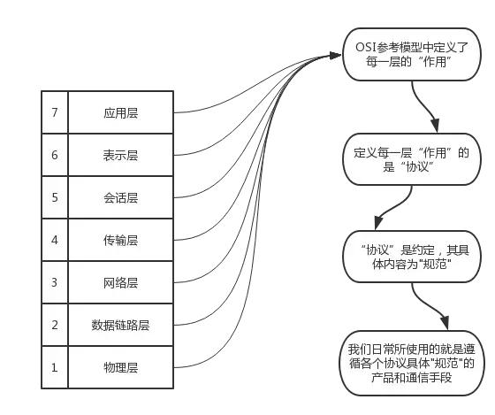

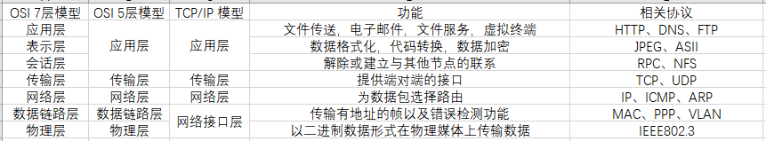

OSI 五层模型是结合七层模型和TCP/IP模型略加改进的，是学习学习计算机网络原理时采取的一种折衷的办法，在本篇博客中，重点关注的是TCP/IP的上面三层，即应用层，传输层和网络层。

### 二、TCP/IP基础

#### 1.TCP/IP的具体含义

若从字面理解，一眼看去TCP/IP就表示TCP和IP这俩种协议，在实际生活中也确实如此。但更准确的说，TCP/IP是一系列网络协议的统称，其中不乏包括我们熟知的HTTP,FTP,TCP,UDP,ICMP等等，因此它是一个协议族。

#### 2.一些名词解释

- 包：全能型术语，其实就是每一层传输的数据，是一个统称。
- 帧：用于表示数据链路层中包的单位，
- 段：表示TCP数据流中的信息。
- 消息：应用协议中的数据单位。
- 数据包：是网络层以上的分层中包的单位。

每个分层中，都会对所发送的数据附加一个首部，在这个首部中包含了该层的必要信息，如发送的目标地址以及协议相关信息等。通常，为协议提供信息的为包首部，所要发送的内容为数据。从下一层的角度看，从上一层收到的包全部被认为是本层的数据。

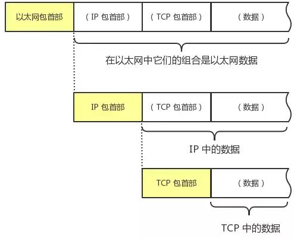

数据在应用层产生，在往下传的过程中，每一层都会加一个该层的特定标识（包首部），主要是为了保证数据传输的可靠性，方便接收端各层都能够解析到自己的数据。例如一组数据从发送方的应用层出发，到传输层时该层会为为其添加一个TCP包首部（这里假设传输层用的是TCP协议，后面添加的特定包首部与此意义相同），在网络层接收到“TCP包首部+数据”后，会将其当作自己的数据，并在前面添加IP包首部，接着，数据链路层收到"IP包首部+数据"，将其作为自己的数据，并为其添加以太网包首部，最后“以太网包首部+数据”作为一个完整的包发送给接收端。

接收端在接收到发送端发送来的数据后，以相反的顺序解析数据包，首先物理层收到该数据包，传到数据链路层，数据链路层识别以太网首部，去掉该包首部，把数据传向网络层，网络层识别IP包首部，去掉该包首部，将数据传给传输层，传输层再识别TCP包首部，切掉它，并把最终的数据给应用层。

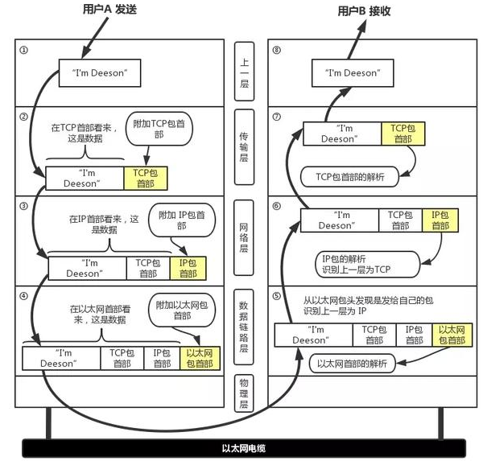

### 三、应用层中的协议

#### 1.HTTP协议（超文本传输协议）

HTTP协议是运行在TCP上的协议，是用于从万维网服务器传输超文本到本地浏览器的传送协议，是基于TCP/IP通信协议来传递数据的（HTML文件，图片文件，查询结果等），另外HTTP是C/S架构模型（客户端/服务器），通过一个可靠的链接来交换信息。浏览器作为HTTP客户端向WEB服务器发送请求，WEB服务器收到请求后，向HTTP客户端发送响应消息。

##### 1.1 HTTP协议的工作流程

a.地址解析：比如客户端浏览器请求浏览页面www.baidu.com，其实这是一个默认路径，平常默认会省略协议名，端口号，访问主页时，路径也将被省略，所以它的完整写法应该是http://www.baidu.com:80/index.html。这就是我们常说的统一资源定位符（URL），用来定位我们访问资源在服务器上的位置。对于这个URL来说：

- 协议名：http
- 主机名：www.baidu.com
- 端口号：80（http的默认端口号）
- 路径：/index.html

这时需要域名解析系统DNS协议来解析域名，得到主机的ip。

##### 2）封装http请求数据包

将我们想要访问的服务器页面资源结合自己的主机信息生成一个请求数据报文，封装为一个HTTP请求数据包。

##### 1.2 HTTP请求报文

HTTP请求报文由请求行，请求头部，空行和请求体四部分构成。

- 请求行由请求方法，URL地址，协议名称和版本号三块组成。
- 请求头部：用来说明服务器要是用的附加信息，包含若干个属性，格式均为“属性名：属性值”，服务端由此获得客户端的信息。
- 请求体：将一个页面表单中的组件值通过键值对形式编码成一个格式化串，它承载着多个请求参数的数据。

```
HTTP有哪些常见的请求方法
HTTP1.0定义了三种请求方法：GET,POST和HEAD方法
HTTP1.1新增了五种请求方法：OPTIONS,PUT,DELETE,TRACE和CONNECT
GET：请求指定的页面信息，并返回实体主体
HEAD：类似于GET请求，只不过返回的响应中没有具体内容，用于获取报头
POST：向指定资源提交数据进行处理请求（例如提交表单或者上传文件），数据被包含在请求体中，POST请求可能会导致新的资源建立/已有资源修改
PUT：从客户端向服务器传送的数据取代指定的文档的内容。
DELETE：请求服务器删除指定的页面。
CONNECT：HTTP1.1协议中预留给能够将连接改为管道方式的代理服务器。
OPTIONS：允许客户端查看服务器的性能。
TRACE：回显服务器收到的请求，主要用于测试或诊断。

GET和POST的区别
1.GET提交的数据会放在URL之后，以?分割URL和传输数据，参数之间用&连接，而POST方法把提交的数据放在HTTP包的请求体当中。
2.GET提交的数据大小有限制（因为浏览器对URL的长度有限制），而POST方法提交的数据没有限制。
3.GET方式提交数据会带来安全问题，比如一个登录页面，通过GET方式提交数据时，用户名和密码出现在URL上，如果页面可以被缓存或者其他人可以访问这台机器，就可以从历史记录获得该用户的账号和密码。
```

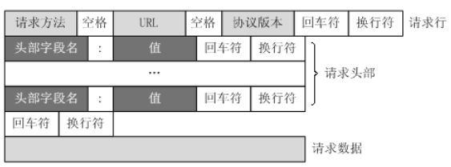

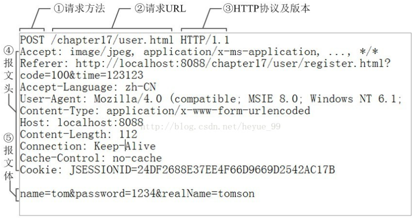

##### 1.3 HTTP响应报文

HTTP响应报文也有四部分组成，分别是响应行，响应头，空行和响应体。

- 响应行：协议名称及版本号，状态码及描述
- 响应头：跟请求头一样，由属性组成，说明客户端要用的一些附加信息
- 响应体：是服务器返回给客户端的文本信息

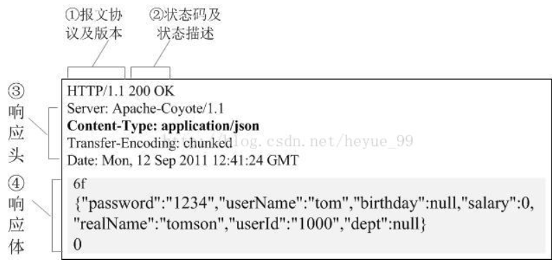

```
响应状态码
1XX：指示信息，表示请求已收到，继续处理
2XX：处理成功，表示请求已被接收，理解，接受
3XX：重定向，要完成请求必须进行进一步的操作
4XX：客户端错误，请求有语法错误或者请求未实现
5XX：服务器端错误，服务器未能实现合法的请求

常见的状态码及状态描述
200 OK：找到资源，客户端请求成功
302/307：临时重定向，指出请求的文档已被临时移动到别处, 此文档的新的url在Location响应头（响应首部字段）中给出
304 (NOT MODIFIED): 该资源在上次请求之后没有任何修改。这通常用于浏览器的缓存机制。
400 (Bad Request):客户端请求有语法错误，不能被服务器所理解
401 (UNAUTHORIZED): 客户端无权访问该资源。这通常会使得浏览器要求用户输入用户名和密码，以登录到服务器。
403 (FORBIDDEN): 客户端未能获得授权。这通常是在401之后输入了不正确的用户名或密码。
404 (NOT FOUND): 在指定的位置不存在所申请的资源。
500 Internal Server Error：看到这个错误，你就应该查查服务端的日志了，肯定抛出了一堆异常，别睡了，起来改BUG去吧！
503 (Server Unavailable):服务器当前不能处理客户端的请求，一段时间后可能恢复正常
```

##### 1.4 HTTP1.0,HTTP1.1和HTTP2.0的区别

- 长连接：在HTTP1.0中，TCP每建立一次连接就只能发送一个HTTP请求并得到一个HTTP响应，当需要再次发送请求的时候，又得重新建立TCP连接，这样耗时且传输效率低；HTTP1.1中支持长连接和流水线传输，在TCP连接中可以传输多个HTTP请求和响应，减少了建立和关闭连接的消耗和延时，HTTP1.1中，默认开启Connect：Keep-Alive；

注：长连接不可能一直保持，会有一个超时时间，服务器会告诉客户端超时时间。

- 缓存处理：
- 带宽优化及网络连接的使用：HTTP1.0中存在浪费带宽的现象，例如客户端只是需要某个对象的一部分，而服务器却将整个对象传过来了；HTTP1.1中引入了Range头部字段，它允许只请求资源的某一部分，即返回状态码是206；
- HOST头处理：在HTTP1.0中认为每台服务器绑定一个唯一的IP地址，因此请求消息在URL中并没有传递主机名。但随着虚拟技术的发展，在一台物理设备上可以存在多台虚拟主机，并且它们共享同一IP地址。在HTTP1.1的请求消息和响应消息中都支持HOST头域，且请求消息中没有HOST头域会报错；
- 错误通知的管理：HTTP1.1中新增了24个错误状态码，如409表示请求的资源与资源的当前状态发生冲突；410表示服务器上的某个资源被永久性删除等。

与HTTP2.0的区别：

- 在HTTP1.1中消息体一般会经过压缩或本身传输的就是压缩后的二进制文件，而消息头部是以文本进行传输的，在HTTP2.0中对消息头部进行了压缩；
- 服务器推送，服务器推送是一种客户端请求之前发送数据的机制。在HTTP1.1中这些资源每一个都必须明确的请求，这是一个很漫长的过程，浏览器从获取HTML开始，然后在它解析和评估页面的时候，增量的获取更多的资源。因为服务器必须等待浏览器做每一个请求，网络经常是空闲的和未充分使用的。为了改善延迟，HTTP2.0引入了server push，它允许服务端推送资源给浏览器，在浏览器明确请求之前，免去客户端再次创建连接发送请求到服务器端获取，这样客户端可以直接从本地加载这些资源，不用再通过网络。

#### 2.DNS协议（域名解析协议）

如果说ARP协议是用来将IP地址转换为MAC地址，那么DNS协议就是将域名转换为IP地址，当然它也可以将IP地址转换为对应的域名地址，域名服务是基于UDP实现的，服务器的端口号为53。

为什么不直接用IP地址或者域名地址来进行通信？

- IP地址是固定长度的，IPv4是32位，IPv6是128位，而域名是变长的，不利于计算机处理。
- IP地址对于用户来说不方便记忆，但是域名方便用户使用，例如www.baidu.com这是百度的域名。
- 总结一点就是IP地址是面向主机的，而域名是面向用户的。

##### 2.1 域名解析过程

（1）输入域名后，先检查主机对应的域名服务器，域名服务器先查找自己数据库中的数据

（2）如果没有，就想上一级域名服务器进行查找，依次类推

（3）最多回溯到根域名服务器，肯定可以查到这个域名的IP地址

（4）域名服务器自身也会进行一些缓存，把曾经访问过得域名和对应的IP地址缓存起来，可以加速查找的过程

具体过程描述如下：

（1）主机先向本地域名服务器进行递归查询

（2）本地域名服务器采用迭代查询，向一个根域名服务器进行查询

（3）根域名服务器告诉本地域名服务器，下一步应该查询的顶级域名服务器的IP地址

（4）本地域名服务器向顶级域名服务器进行查询

（5）顶级域名服务器告诉本地域名服务器，下一步查询的权限服务器的IP地址

（6）本地域名服务器向权限域名服务器进行查询

（7）权限域名服务器告诉本地域名服务器所查询的主机IP地址

（8）本地域名服务器把最后的查询结果告诉主机

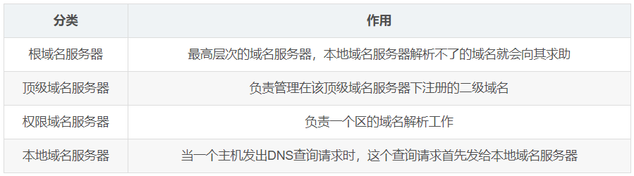

##### 2.2 迭代查询和递归查询

- 递归查询：主机向本地域名服务器发出一次查询请求，静待最终的查询结果。如果本地域名服务器无法解析，自己则会以DNS客户机的身份向更高级的域名服务器查询，直到得到目标IP告诉主机。
- 迭代查询：本地域名服务器向根域名服务器查询，根域名服务器告诉它下一步到哪里去查询，然后它在根据根域名服务器的指示进行下一步查询，以此类推，每次本地域名服务器都是以客户机的身份去各个服务器查询的。

通俗地说，递归就是把一件事情交给别人，如果事情没有办完，哪怕已经办了很多，都不要把结果告诉我，我要的是你的最终结果，而不是中间结果；如果你没办完，请你找别人办完，把最后结果告诉我就好了。迭代则是我交给你一件事，你能办多少就告诉我你办了多少，然后剩下的事情我按照你的指示继续去办，知道查到最终的结果。

更多关于DNS的知识，参见博客：https://blog.csdn.net/baidu_37964071/article/details/80500825

### 三、传输层中的协议

TCP/IP中俩个最具代表性的传输层协议，分别是TCP和UDP。前者是可靠的流协议，后者是不可靠的数据包协议，关于他们的特点简单介绍如下：

- TCP是面向连接的，可靠的流协议。流是指数据流，是不间断的数据结构，建立TCP连接发送数据时，可保证发送数据的顺序。TCP提供可靠性传输，具有“顺序控制”和“重发机制”，此外还有“流量控制（流控制）”，“拥塞控制”等众多功能。
- UDP是不可靠的数据包协议，只负责发送数据（可以控制发送消息的大小），但不能保证消息一定会到达接受方，UDP是没有重发机制的，这一机制由应用程序自己根据需要进行定义。
- TCP和UDP没有绝对的好坏之分，不然另一方早被淘汰，TCP主要用于可靠传输的情况，而对于高速传输和对实时性有较高要求的通信则一般用UDP，所以TCP和UDP应该根据应用的目的按需使用。

#### 1.端口号

数据链路层和网络层中分别使用的是Mac地址和IP地址，前者主要是区别同一链路中的不同的计算机，后者主要是识别TCP/IP网络中互联的主机和路由器。其实在传输层中也有类似于地址的东西，那就是端口号，不过它是用来识别同一台计算机中进行通信的不同应用程序，因此，它又被称为程序地址。

##### 1.1 根据端口号识别应用

一台计算机上可同时运行多个程序，传输层协议就是靠端口号来识别本机中正在进行通信的应用程序，并将数据准确传输。

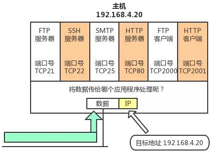

##### 1.2 通过IP地址，端口号和协议号进行通信

上面提到用端口号去识别哪个应用程序在进行通信，但这是远远不够的。想象一下，一个客户端要发送数据给目标服务器都需要知道些什么？首先是要发送的数据，这是必不可少的，不然你发了有何意义；其次是目标服务器的IP地址和端口号，当然为了能收到服务器的响应，还必须附上自己的IP地址和端口号；当IP地址和端口号都相同时呢，还可以通过协议号来进行区分（TCP/UDP），至此就可以进行通信了，下图中列出了通信的方法以及各数据报需要的信息。

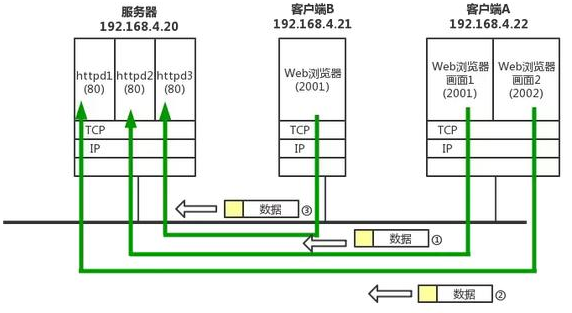

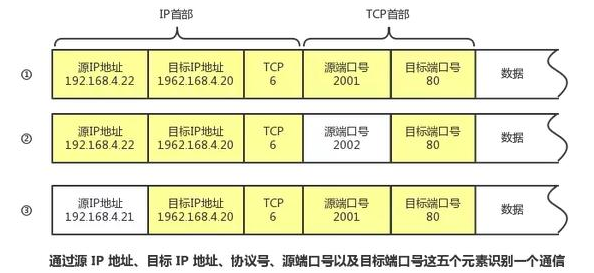

##### 1.3 端口号的确定

- 标准既定的端口号

这种方法也叫静态方法，它是指每个应用程序都有指定的端口号，不能随意使用任意一个端口号，例如我们熟知的FTP，HTTP等应用层协议都有自己的端口号，这些端口号被称为知名端口号，分布在0~1023之间；此外，还有一些端口号被正式注册，它们分布在1024~49151之间，不过这些端口号可用于任何通信用途。

- 时序分配法

服务器有必要对端口号进行监听，但接受服务的客户端却没有必要，因此，客户端的应用程序完全可以不用自己设置端口号，而全权交给系统自动分配，动态分配的端口号范围在49152~65535之间。

#### 2.UDP协议

- UDP不能提供复杂的控制机制，利用IP提供面向无连接的通信服务
- UDP是一种“将应用程序发来的数据在收到的那一刻，立即按照原样发送到网络上”的机制，即使网络中有拥塞的情况，UDP也无法进行流量控制来避免拥塞
- UDP在传输中存在丢包的可能，且不负责重发，甚至当包的到达顺序出现乱序也没有纠正功能，故如需要进行相关细节控制，需交由UDP的应用程序去处理。
- UDP常用于以下几个方面：1.总包量较少的通信（DNS,SNMP等）；2.视频，音频等的传输（即时通信）；3.现定于LAN等特定网络中的应用通信；4.广播通信（广播，多播）

#### 3.TCP协议

TCP与UDP的区别很大，主要区别在于TCP能够实现可靠传输，它充分实现了数据传输时的各种控制功能，可以在丢包时进行重发控制，可以对乱序的分包进行顺序控制，可以在检测到网络拥塞时进行拥塞控制等等，TCP作为一种面向连接的协议，只有在确认通信对端存在时才会发送数据，从而控制了流量的浪费。

根据TCP的这些机制，在IP这种无连接的网络上也能够实现高可靠性的通信（主要通过校验和，序列号，确认应答，连接管理以及窗口控制等机制实现），后面将会专门写一篇详细介绍TCP协议的博客，这里不再展开叙述。

### 四、网络层中的IP协议

- IP（IPv4,IPv6）处于网络层，网络层的主要作用是“实现终端节点之间的通信”，这种终端节点之间的通信也叫做“点对点通信”。
- 数据链路层的主要作用是在互联同一种数据链路的节点之间进行包传递，而一旦跨越多种数据链路，就需要借助网络层，网络层可以跨越不同的数据链路，即使是在不同的数据链路上也能实现节点之间的数据包传输。
- IP大概分为三大作用模块，分别是IP寻址，路由以及IP分包与组包。

#### 1.IP地址

##### 1.1 IP地址概述

在计算机通信中，为了识别通信对端，必须要有类似于地址的识别码来进行识别，比如在数据链路层，就采用MAC地址来区别同一链路中的不同主机，再比如端口号用来区分同一主机中进行通信的应用程序，在网络层中，也有一种叫做IP地址的信息，它用在“连接到网络中的所有主机中识别出进行通信的目标地址”，因此，在TCP/IP通信中所有主机或者路由器都必须设定自己的IP地址。

IP地址（IPv4）由32位二进制数来表示，我们一般是将其8位分为一组，分成4组，用点十进制法来表示，具体如下：

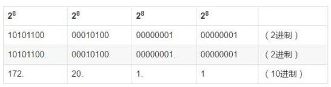

##### 1.2 IP地址的组成

IP地址由网络和主机俩部分标识组成。网络标识必须保证相互连接的每个段的地址不重复，而相同段内相连的主机必须有相同的网络地址。主机标识则不允许在同一个网络段内出现俩个相同的主机地址，由此可以通过网络地址和主机地址来确保IP地址的唯一性。

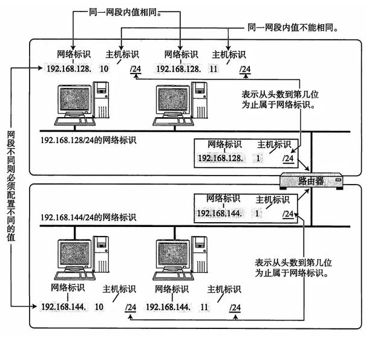

IP包被转发到途中某个路由器时，正是利用目标IP地址的网络标识进行路由，即使看不到主机标识，只要一看到网络标识，就能判断是否是该网段的主机。

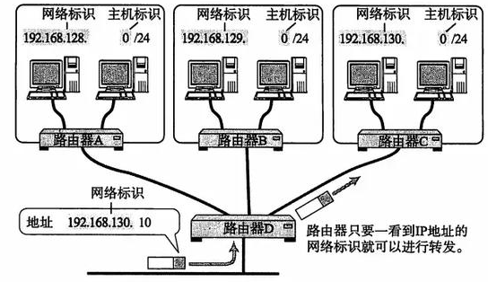

##### 1.3 网络地址的分类

IP地址划分为四个级别，分别是A类，B类，C类和D类。它是根据网络标识中固定的位数和数字来划分的。

- A类地址的首位是由“0”开头，他的网络标识占8位，主机标识占24位，用点分十进制表示的话，其网络号范围在0.0.0.0-127.0.0.0之间，A类网络的一个网段最多可容纳2^24-2个主机。
- B类地址的的前俩位是“10”，它有16位网络标识和16位主机标识，用点分十进制表示的话，其网络号范围在128.0.0.0-191.255.0.0之间，它的一个网段最多可容纳2^16-2个主机。
- C类地址的前三位是“110”，它有24位网络标识和8位主机标识，用点分十进制表示，其网络号范围在192.0.0.0-223.255.255.0之间，每个网段可最多容纳主机2^8-2=254个主机。
- D类地址的前四位是“1110”，它有32位网络标志，用点分十进制的话，224.0.0.0-239.255.255.255都是D类地址，D类地址没有主机标识，常用于多播。

注：**在分配主机标识时要注意，主机号全0或者全1是不可用的，因为全0只有在表示对应网络地址或者IP地址不可获得的情况下才会使用，全1的主机通常作为广播地址，这就是为什么各类地址主机可分配数减2的原因。**

##### 1.4 广播地址和多播地址

- 广播地址用于在同一链路中相互连接的主机之间发送数据包，将主机号全部置位1就是广播地址，广播地址分为本地广播和直接广播俩种，在本网络中的广播叫做本地广播，在不同网络之间的广播叫做直接广播。
- 多播地址用于将包发送给特定组内的所有主机，相比于广播，多播既可以穿透路由器，又可以实现只给那些必要的组发送数据包。

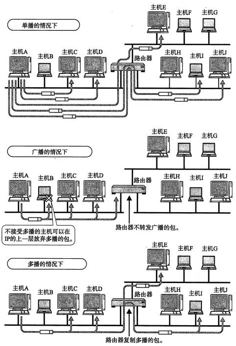

- IP多播用的是D类地址，因此若首四位是“1110”,就认为是多播地址，剩下的28位可以成为多播的组编号，此外对于多播，所有主机必须（路由器以外的主机和终端主机）必须属于224.0.0.1的组，所有路由器必须属于224.0.0.2的组。

##### 1.5 子网掩码

- 网络标识位全为1，主机标识位全为0，就构成了子网掩码，由此一个IP地址不在受限于自己的类别，而是可以用这样的子网掩码来自由地定位自己的网络标识长度。
- 子网掩码的俩种表示方式：1.IP地址和子网掩码分俩行来表示，一行IP地址，一行子网掩码；2.在每个IP地址追加一个网络标识位的长度，并用“/”隔开。

#### 2.路由

- 发送数据包时使用的是IP地址，然而仅有IP地址可能不足以实现将数据包发送到对端的目标地址，在数据发送的过程中还需要类似于“指明路由器或主机”的信息，以便发往正确的目标地址，保存这种信息的就是路由控制表。
- 路由控制表有俩种形成方式，一种是管理员手动设置，另一种是路由器与其他路由器交换信息自动刷新，前者叫做静态路由控制，后者叫做动态路由配置。
- IP协议始终认为路由表是正确的，IP本身并没有定义制作路由控制表的协议，即IP没有制作路由控制表的机制，该表是由“路由控制协议”来完成的。

##### 2.1 IP地址与路由控制

IP地址的网络标识部分用于路由控制，路由控制表中记录着不同网络地址与下一步应该要发送至路由器的地址。在发送IP包时，首先要确定IP包首部中的目标地址，从路由控制表中找到与该目标地址具有相同地址的记录，根据该记录将IP包转发给相应的下一个路由器，如果路由控制表中存在多条相同网络地址的记录，就选择一个最为吻合的网络地址。

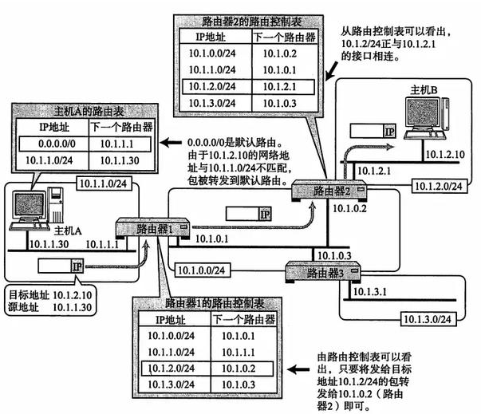

#### 3.IP分包与组包

- 每种数据链路的最大传输单元（MTU）都不尽相同，因为每个不同类型的数据链路的使用目的不同，故可承载的MTU也就不同。
- 任何一台主机都会对IP分片进行相应的处理，分片往往是在网络上遇到比较大的报文无法一下子发送出去时才会进行处理，经过分片之后的IP数据包在被重组时，只能由目标主机进行，路由器只负责转发，不负责重组。

#### 4.IPv6地址

IPv6是为了从根本上解决IPv4地址耗尽的问题而被标准化的网际协议。IPv6的地址长度用128位二进制数来表示，是IPv4的4倍长。

##### 4.1 IPV6的特点

- IP 地址的扩大与路由控制表的聚合。
- 性能提升。包首部长度采用固定的值（40字节），不再采用首部检验码。简化首部结构，减轻路由器负担。路由器不再做分片处理。
- 支持即插即用功能。即使没有DHCP服务器也可以实现自动分配 IP 地址。
- 采用认证与加密功能。应对伪造 IP 地址的网络安全功能以及防止线路窃听的功能。
- 多播、Mobile IP 成为扩展功能。

##### 4.2 IPv6中IP地址的标定方法

- 一般16位一组进行标记，共有8组，每组之间用“ ：”隔开，四位一组转换为16进制数；
- 出现连续的0时可以用“：：”代替，但是一个IP地址中只能出现一次“：：”，不然没法区分每个“：：”代替了多少个0。

##### 4.3 IPv6地址的结构 

- IPv6类似于IPv4，也是通过IP地址的前几位标识IP地址的种类。
- 在互联网通信中，使用一种全局的单播地址。它是互联网中唯一的一个地址，不需要正式分配IP地址。

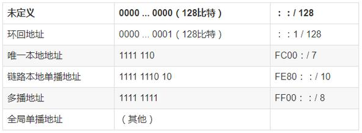

#### 5.IP协议相关技术

IP旨在让目标主机收到数据包，但是在这一过程中仅仅有IP时不够的，必须还要能够解析主机名称和MAC地址的功能，以及数据包在发送过程中出现异常的处理功能等。

##### 5.1 DNS

我们平常访问某个网站不是直接用IP地址，而是用一串罗马字和点号组成的字符串，能够这样做是因为有DNS功能的支持，DNS可以将串字符自动转换为具体的IP地址，此外DNS不仅适用于IPv4，也适用于IPv6。

##### 5.2 ARP

- 一旦确定了目标IP，就可以向这个目标地址发送IP数据包，但在数据链路层中进行通信时用的是IP地址对应的MAC地址，ARP就是一种解决地址转换问题的协议，它以目标IP为线索，用来定位下一个应该接收数据分包的网络设备对应的MAC地址。不过ARP只适用于IPv4，不能用于IPv6，IPv6可以用ICMPv6替代ARP发送邻居探索消息。
- RARP：顾名思义是ARP的反向操作，即将MAC地址转换为IP地址

##### 5.3 DHCP

为每一个主机设置IP地址是很繁琐的事情，特别是在使用移动设备时，每换一个地方就要重新设置IP地址。为了自动配置IP地址，统一管理IP地址分配，就产生了DHCP协议。有了DHCP，计算机只要连接到网络，就可以进行TCP/IP通信，也就是说，DHCP让即插即用变得可能，DHCP不仅在IPv4中，也可在IPv6中使用。

##### 5.4 ICMP

- ICMP的主要功能包括确认IP包是否成功送达目标地址，通知在发送过程中IP包被废弃的具体原因，改善网络设置等。
- IPv4中ICMP仅作为一个辅助作用支持IPv4，也就是说，在使用IPv4时，即使没有ICMP，仍然可以进行IP通信，然而在IPv6中，ICMP的作用被扩大，若没有ICMPv6，IPv6是无法进行通信的，因为它涉及到IP地址和MAC地址的转换。

##### 5.5 NAT

- NAT是用于在本地网络中使用的私有地址，在连接互联网时转而使用全局IP地址的技术。
- 除了IP地址的转换，还出现了转换TCP，UDP端口号的NAPT技术，由此可以实现用一个全局IP地址与多个主机的通信。
- NAT（NAPT）实际上是为了正在面临地址枯竭的IPv4而开发的技术，不过在IPv6中为了提高网络安全也在使用NAT，在IPv4和IPv6之间的相互通信中常常使用NAT-PT。
