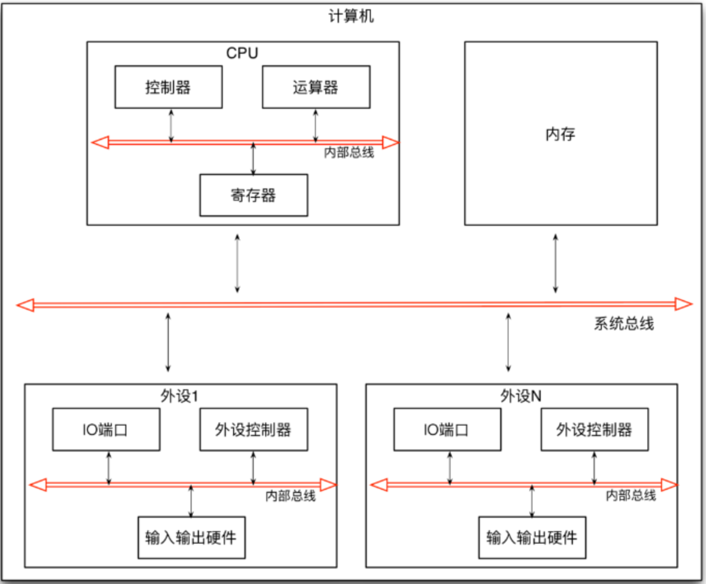

操作系统内存管理包括：物理内存管理和虚拟内存管理。

物理内存管理：包括程序装入等概念，交换技术，连续分配管理方式和非连续分配管理方式（分页，分段，段页式）。

虚拟内存管理：虚拟内存管理包括虚拟内存概念，请求分页管理方式，页面置换算法，页面分配策略，工作集和抖动。这个专题，将在后面的"Linux内存管理"中介绍。

# 一、计算机的存储体系

## 分层存储器体系

大部分计算机都有的一个存储器层次结构，即少量的非常快速，昂贵，易变的高速缓存（cache）；中等速度，中等价格，易变的主存储器（RAM，即我们说的内存）；低速，廉价，不易变的硬盘。这些资源的合理使用与否直接关系着系统的效率。

```c++
注：cache叫做高速缓冲存储器，是介于中央处理器（CPU）和主存储器之间的高速小容量存储器。cache作用：CPU的速度远高于内存，当CPU直接从内存中存取数据时要等待一定时间周期，而Cache则可以保存CPU刚用过或循环使用的一部分数据，如果CPU需要再次使用该部分数据时可从Cache中直接调用，这样就避免了重复存取数据，减少了CPU的等待时间，因而提高了系统的效率。
详见：https://blog.csdn.net/boyaaboy/article/details/102539578
```

计算机是一种数据处理设备，它有CPU，内存以及外部设备组成。CPU负责数据的处理，内存负责数据的存储，外部设备负责数据的输入和输出，它们之间通过总线连接在一起。CPU主要有控制器，寄存器和运算器组成。其中，控制器负责指令的读取和调度，运算器负责指令的运算执行，寄存器负责数据的存储它们之间通过CPU内部的总线连接在一起。每个外部设备（如显示器，硬盘，键盘，鼠标等等）则是由外设控制器，I/O端口和输入输出硬件组成。外设控制器负责设备的控制和操作，I/O端口负责数据的临时存储，输入输出硬件则负责具体的输入输出，它们之间通过外部设备内的总线连接在一起。



