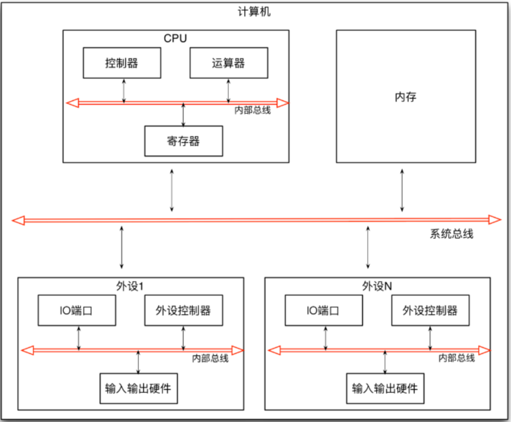
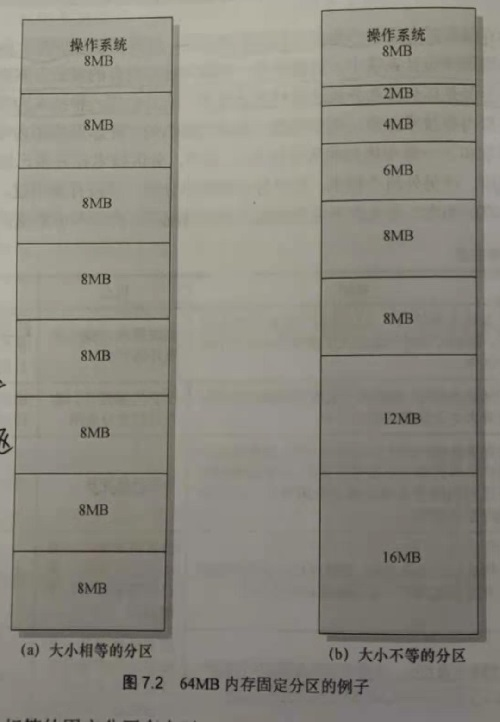
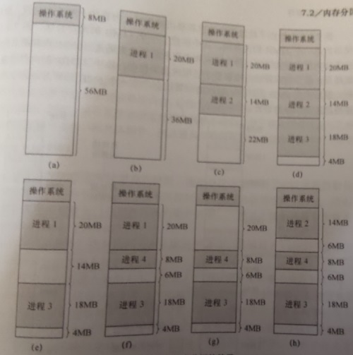
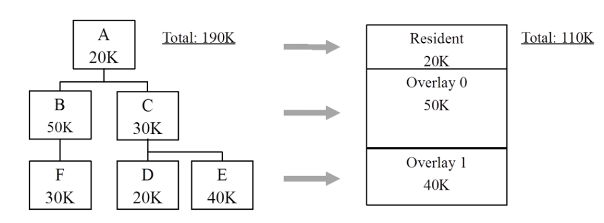
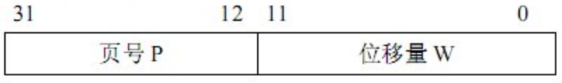
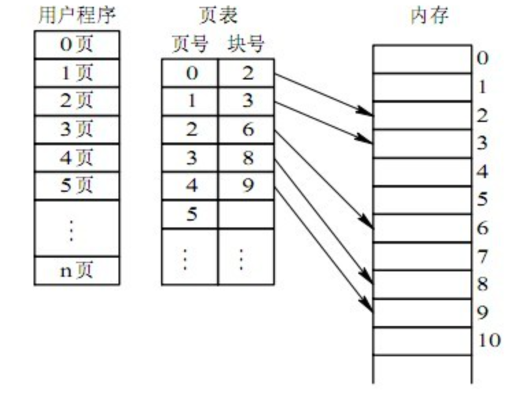
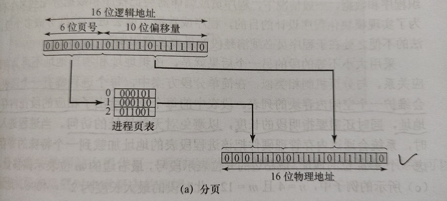
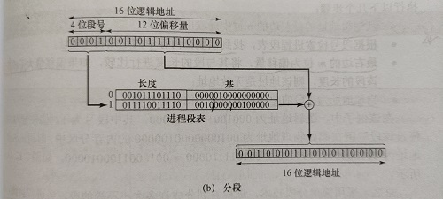

操作系统内存管理包括：物理内存管理和虚拟内存管理。

物理内存管理：包括程序装入等概念，交换技术，连续分配管理方式和非连续分配管理方式（分页，分段，段页式）。

虚拟内存管理：虚拟内存管理包括虚拟内存概念，请求分页管理方式，页面置换算法，页面分配策略，工作集和抖动。这个专题，将在后面的"Linux内存管理"中介绍。

# 一、计算机的存储体系

## 分层存储器体系

大部分计算机都有的一个存储器层次结构，即少量的非常快速，昂贵，易变的高速缓存（cache）；中等速度，中等价格，易变的主存储器（RAM，即我们说的内存）；低速，廉价，不易变的硬盘。这些资源的合理使用与否直接关系着系统的效率。

```c++
注：cache叫做高速缓冲存储器，是介于中央处理器（CPU）和主存储器之间的高速小容量存储器。cache作用：CPU的速度远高于内存，当CPU直接从内存中存取数据时要等待一定时间周期，而Cache则可以保存CPU刚用过或循环使用的一部分数据，如果CPU需要再次使用该部分数据时可从Cache中直接调用，这样就避免了重复存取数据，减少了CPU的等待时间，因而提高了系统的效率。
详见：https://blog.csdn.net/boyaaboy/article/details/102539578
```

计算机是一种数据处理设备，它有CPU，内存以及外部设备组成。CPU负责数据的处理，内存负责数据的存储，外部设备负责数据的输入和输出，它们之间通过总线连接在一起。CPU主要有控制器，寄存器和运算器组成。其中，控制器负责指令的读取和调度，运算器负责指令的运算执行，寄存器负责数据的存储，它们之间通过CPU内部的总线连接在一起。每个外部设备（如显示器，硬盘，键盘，鼠标等等）则是由外设控制器，I/O端口和输入输出硬件组成。外设控制器负责设备的控制和操作，I/O端口负责数据的临时存储，输入输出硬件则负责具体的输入输出，它们之间通过外部设备内的总线连接在一起。



上图所述设计思想又被称为冯.诺依曼体系，在这里面，总有一部分负责控制，一部分负责执行，一部分负责存储，它们之间进行交互以及接口通信是通过总线来完成的。

# 二、物理内存：连续分配存储管理方式

连续分配是指为一个用户进程分配一段连续的内存空间，连续分配有单一连续存储管理和分区式连续存储管理。

## 2.1 单一连续存储管理

在这种存储管理方式下，内存被分为俩个区：用户区和系统区。用户进程被加载进用户区，可使用用户区的全部空间，其特点是简单，适用于单用户，单任务的操作系统，CP/M和DOS2.0就是采用这种存储管理方式。这种方式最大的优点是易于管理，但也存在一些问题，如对内存空间要求小的程序，造成内存浪费；程序全部装入，使得很少使用的程序也占用一定的内存。

## 2.2 分区式存储管理方式

为了支持多道程序系统和分时系统，支持多个程序的并发执行，引入了分区式存储管理方式。分区式存储管理是把内存划分为一些大小相等或不等的区域，操作系统占其中的一个分区，其余分区由用户进程使用。分区式存储管理虽然可以支持并发，但难以进行分区之间的共享，并且带来了俩个问题：内部碎片和外部碎片（后面结合固定分区和动态分区分别解释）。

为实现分区式存储管理，操作系统应维护的数据结构为分区表或分区链表。表中各表项一般包括每个分区的起始地址，大小及状态（是否已分配）。

### 2.2.1 固定分区

在系统生成阶段，内存被划分为多个静态分区，进程可以被加载到大于或者等于自身大小的分区中



上面是俩个固定分区的例子，一个使用了大小相等的分区，这种情况下，任何小于或等于分区大小的进程都可以被加载进任意个可用的分区内。如果所有分区被装满，并且没有进程处于就绪或运行状态，操作系统就可以换出任何一个分区中的进程，并加载另一个进程，处理器处于忙碌状态。

大小相等的固定分区有俩个问题：

1.程序太大以至于不能放到一个分区中。此时要用覆盖技术来设计程序，使得在任何时候只需要将程序的一部分载入内存也可以正常运行，当所需模块不在时，用户程序必须覆盖程序所在分区中的程序和数据，将该模块加载到该分区中。

2.内存利用率低。所有程序，即便很小，都会占用一个完整的分区，由于载入的数据小于分区的大小，导致分区内部存在空间浪费，这种现象称为“内存碎片”。

这俩个问题可通过划分大小不等的分区的方法来缓解，但也不能完全解决。

优点：实现简单，操作系统开销较少

缺点：内存碎片使内存不能充分使用，活动进程的最大数目是固定的

## 2.2.2 动态分区

分区动态创建，因此每个进程可以被加载到与自身大小刚好相等的分区中



上面是一个动态分配的例子，可以看出，刚开始效果是不错的，但最终会在内存中出现很多较小的洞，随着时间的推移，内存中将产生越来越多的碎片，而内存的利用率也随之降低，这种现象称为“外部碎片”，指的是所有分区外的内存空间中的碎片会变的越来越多。

外部碎片可通过内存紧缩来解决，操作系统不时地移动进程，使得进程仍然占用连续的内存空间，同时所有空闲的内存空间也在一片连续的内存区域中，如上图就可以通过压缩产生一个16MB的连续空闲内存空间，这些足以装入一个进程，但是，压缩是一个非常耗时的过程，会浪费处理器的时间，此外，该技术还需要动态重定位功能的支持。

下面列举了动态分区常见的几种放置算法：

1.最佳适应算法:选取与进程大小最接近的内存块

2.首次适应算法：从内存的起始处开始扫描内存，选取第一个能够容纳该进程的内存块

3.下次适应算法：从上次放置进程的内存位置开始扫描内存，选取下一个能够容纳该进程的内存块

首次适应算法的不仅简单，而且一般是最好也是最快的。下次适应算法比首次适应算法的效果要差，它通常会在内存的尾部分配可用的内存空间，这将导致内存尾部最大的空闲内存空间很快被切分成很多容量较小的碎片，因此需要更多次的压缩解决碎片问题。另外，首次适应算法会使内存的前端出现很多小的空闲分区，在采用首次适应算法进行空闲检索时，都需要遍历这些分区，最佳适应算法的表现是最差的，该算法需要查找满足需求的最小内存块，导致产生的碎片更小，尽管每次需求分配后浪费的内存空间最小，但结果却是内存中产生很多较小的空闲的内存块，这些块很小，以至于无法满足任何一个内存需求，因此，它需要比其他算法更多的压缩次数。

优点：没有内部碎片，内存可充分使用

缺点：由于需要压缩来应对外部碎片，处理器的利用率低

## 2.3 伙伴系统

固定分区限制了活跃进程的数目，且当进程大小与分区大小极不匹配时造成内存浪费，内存利用率低；动态分区方案维护复杂，且存在压缩的额外开销，伙伴系统是一种更有吸引力的方式。

- 在伙伴系统中，内存块的大小一般为2<sup>K</sup>个字，且满足L≤K≤U，其中：
- 2<sup>L</sup>表示可以分配的最小内存块的大小，2<sup>U</sup>表示可分配的最大内存块的大小，通常2<sup>U</sup>为可供分配的整个内存的大小

初始情况下，可供分配的整个空间被视为一个大小为2<sup>U</sup>的块，假设要请求大小为s的块，如果2<sup>U-1</sup>≤s≤2<sup>U</sup>，则将整个空间分配给他；否则将该块分为大小相等的俩个伙伴，每个伙伴的大小为2<sup>U-1</sup>;如果2<sup>U-2</sup>≤s≤2<sup>U-1</sup>，则将其中任意个伙伴分配给该请求，否则继续将其中一个伙伴一分为二。这个过程将一直持续，直到产生一个大于或等于s的最小块，将该块分配给该请求。在任何时刻，伙伴系统会维护着一个有很多洞（未使用的内存块）的列表，每个洞的大小为2<sup>i</sup>。一个洞可以被一分为二，从列表（i+1）中删除，并在列表i中创建俩个大小为2<sup>i</sup>的伙伴。当列表i中有一对未使用的伙伴时，它们将从该列表中移除，并在列表i+1中创建一个大小为2<sup>i+1</sup>的一个块。

## 2.4 覆盖技术

引入覆盖技术的目标是在较小的可用内存中运行较大的程序，这种程序多用于多道程序系统中，与分区式存储管理配合使用。

原理：一个程序的几个数据段和代码段，按照时间先后占用公共的内存空间，将程序必要部分（常用功能）的代码和数据常驻内存；可选部分（不常用功能）平时存放在外存中，需要时再装入内存。不存在调用关系的模块可以不同时装入内存，从而可以相互覆盖。

在任何时候，只装入需要的指令和数据，在需要其他数据指令时，再把它们装入刚刚不再需要的指令和数据所占用的内存中去。

缺点：编程时要划分模块，确定模块之间的覆盖关系，增加了编程难度；从外存装入覆盖文件，以时间延长换取空间节省。

覆盖的实现方式有两种：以函数库方式实现或操作系统支持。

# 

上图所示，在同一时刻，CPU只执行B,C中的一个，B,C之间就可以进行覆盖。

## 2.5 交换技术

交换技术是多个程序并发执行时，可以将暂时不能执行的程序（进程）送到外存中，从而获得空闲内存空间来装入新的程序（进程），或读入保存在外存中而处于就绪状态的程序。交换的单位是整个进程的地址空间，交换技术常用于多道程序系统和小型分时系统中，因为这些系统大都采用分区存储管理方式，与分区存储管理配合，又叫做“对换”或“滚入”，“滚出”（roll-in,roll-out）。

原理：暂停执行内存中的进程，将整个进程的地址空间保存到外存交换区（换出swap out），而将外存中由阻塞变为就绪的进程的地址空间读入到内存中，并将该进程送到就绪队列（换入 swap in）。

优点：增加并发执行程序的数目，并给用户提供适当的响应时间，与覆盖技术相比，交换技术不影响程序结构。

不足：对换入和换出的控制增加处理器开销，程序整个地址空间都进行兑换，没有考虑执行过程中地址统计的特性。

### 覆盖技术和交换技术的比较

- 与覆盖技术相比，交换技术不要求程序员给出程序段之间的覆盖结构；
- 交换主要是进程与作业之间进行，而覆盖是在同一作业或者进程之间进行，另外覆盖只能覆盖那些与被覆盖程序段无关的程序段。

# 三、 物理内存非连续：页式和段式存储管理

在前面介绍的几种存储管理方法中，为进程分配的空间是连续的，使用的地址都是物理地址。如果允许将一个进程分散到许多不连续的空间，就可以避免内存紧缩，减少碎片。基于这一思想，通过引入进程的逻辑地址，把进程地址空间与实际存储空间分离，增加存储管理的灵活性。

地址空间：将源程序经过编译后得到目标程序，存在于它所限定的地址范围之内，这个范围就是地址空间，地址空间是逻辑地址的组合。

存储空间：指主存中一系列存储信息的物理单元的集合，这些单元的编号称为物理地址，存储空间是物理地址的集合。

根据分配时所采用的基本单位的不同，离散分配的管理方式可分为：页式存储管理，段式存储管理和段页式存储管理，其中段页式存储管理是前俩者的结合的产物。

## 3.1 页式存储管理

### 基本概念

将程序的逻辑地址空间划分为固定大小的“页”，而物理内存划分为同样大小的“页框”。程序加载时可将任意页放入任何一个页框，这些加载了页的页框不必连续，从而实现了离散分配。该方法需要CPU的硬件支持，来实现逻辑地址和物理地址之间的映射，在页式存储管理方式中逻辑地址结构由俩部分构成，一部分是逻辑页号，另一部分是页内偏移量。



注意：页号和偏移量各占多少位是不固定的！

页式管理的优点：

- 没有外部碎片，每个内部碎片不会超过页的大小；
- 一个进程可以不连续存放；
- 便于改变程序占用空间的大小(主要指随着程序运行，动态生成的数据增多，所要求的地址空间相应增长)。

缺点：需要将进程全部装入内存，没有足够内存，程序不能执行，进一步其实是限制了活动进程数。

### 页式存储管理的数据结构

在页式系统中进程建立时，操作系统为进程中所有的页分配页框。当进程撤销时收回所有分配给它的页框。在程序的运行期间，如果允许进程动态地申请空间，操作系统还要为进程申请的空间分配物理页框。操作系统为了完成这些功能，必须记录系统内存中实际的页框使用情况。操作系统还要在进程切换时，正确地切换两个不同的进程地址空间到物理内存空间的映射，这就要求操作系统要记录每个进程页表的相关信息，为此操作系统为每个进程维护一个“页表”。

进程页表：完成逻辑页号（本进程的地址空间）到物理页框号（内存空间）的一个映射，每个进程都有一个页表，主要内容是逻辑页号和物理页框号的对应关系。



物理页面表：整个系统有一个物理页面表，用来标识内存空间的分配使用状况，即那些页框已被分配，哪些页框空闲可被分配，其数据结构可以用位视图或空闲页链表来表示。

请求表：整个系统有一个请求表，描述系统内各个进程页表的位置和大小，用于地址转换也可以结合到各进程的PCB(进程控制块)里。

### 逻辑地址到物理地址的转换

在页式系统中，指令所给出的地址包括俩部分，逻辑页号+页内偏移量，就是我们所说的逻辑地址；

原理：CPU的内存管理单元（MMU）通过进程页表根据逻辑页号获得物理页框号，将物理页框号与页内偏移量相加形成物理地址；

逻辑地址（逻辑页号|页内偏移量）——>进程页表（逻辑页号|物理页框号）——>物理地址（物理页框号|页内偏移量）



一般来说，页表存储在主存之中。这样处理器每访问一个在内存中的操作数，就要访问两次内存：第一次用来查找页表将操作数的逻辑地址变换为物理地址；第二次完成真正的读写操作。这样做时间上耗费严重，为缩短查找时间，可以将页表从内存装入CPU内部的关联存储器(例如，快表) 中，实现按内容查找。此时的地址变换过程是：在CPU给出有效地址后，由地址变换机构自动将页号送入快表，并将此页号与快表中的所有页号进行比较，而且这种比较是同时进行的。若其中有与此相匹配的页号，表示要访问的页的页表项在快表中。于是可直接读出该页所对应的物理页号，这样就无需访问内存中的页表。由于关联存储器的访问速度比内存的访问速度快得多。

## 3.2 段式存储管理

### 基本原理

在段式存储管理中，将程序的地址空间划分为若干段（segment），这样每个进程有一个二维的地址空间。在前面说的动态分区的分配方式中，系统为每个进程分配一个连续的内存空间，而在段式存储管理系统中，则是为每个段分配连续的内存空间，而进程中的不同段可以不连续的放到内存的不同分区中。程序加载时，操作系统为每个段分配所需的内存空间，这些段不必连续，物理内存的管理采用动态分区的方法。

在为某个段分配物理内存时，可采用最佳适应算法，首次适应算法，下次适应算法等。在回收某个段所占用的空间时，要将回收的空间与相邻空间合并。程序通过分段划分为多个模块，如代码段、数据段、共享段：它们可以分别编写和编译，可以针对不同类型的段采取不同的保护，可以按段为单位来进行共享，包括通过动态链接进行代码共享。这样做的优点是：可以分别编写和编译源程序的一个文件，并且可以针对不同类型的段采取不同的保护，也可以按段为单位来进行共享。

段式管理的优点：没有内部碎片，外部碎片可以通过压缩来解决，便于实现内存共享；

缺点：必须把进程全部装入内存中

### 段式管理的数据结构

为了实现段式管理，操作系统需要如下的数据结构来实现进程的地址空间到物理内存空间的映射，并跟踪物理内存的使用情况，以便在装入新的段的时候，合理地分配内存空间。

进程段表：完成逻辑段号（本进程地址空间）到物理段基址（内存空间）的一个映射，每个进程维护一个段表，主要内容是逻辑段号，该段长度，以及该段号对应的物理段基址，段长度用来检测偏移量是否超过段长度。


系统段表：记录已被分配的段。

空闲段表：内存中所有空闲段，可以结合到系统段表。

### 逻辑地址到物理地址的转换

在段式管理系统中，其逻辑地址由逻辑段号和段内偏移量组成。为完成逻辑地址到物理地址的映射，处理器会查找内存中的段表，由段号得到段长度和段基址，将段内偏移量与段长度比较，若段内偏移量大于段长度，则该地址是无效地址，否则物理地址为段基址+段内偏移量。

逻辑地址（逻辑段号|段内偏移量）——>段表（逻辑段号|段长度|段基址）——>比较段长度与段内偏移量——>物理地址（段基址+段内偏移量）




