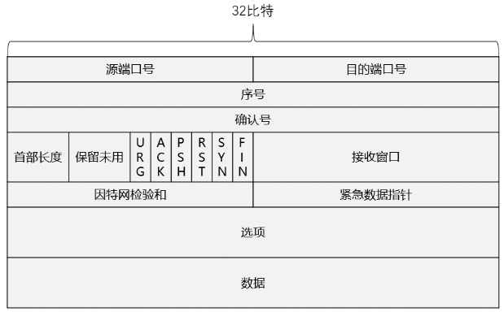
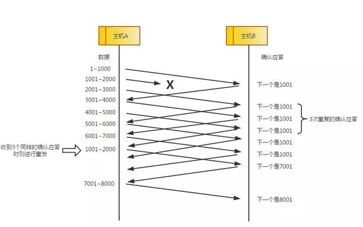
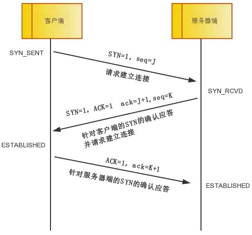
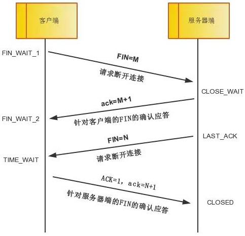
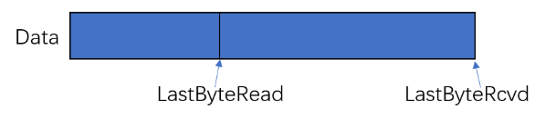
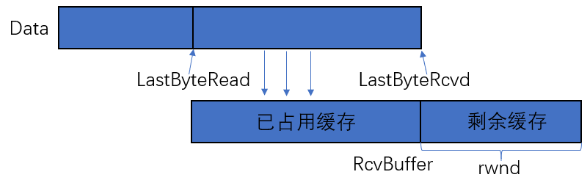
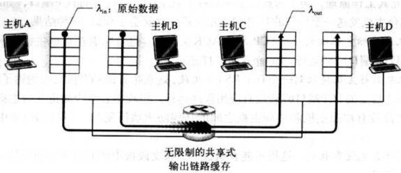
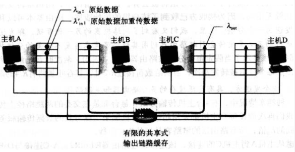
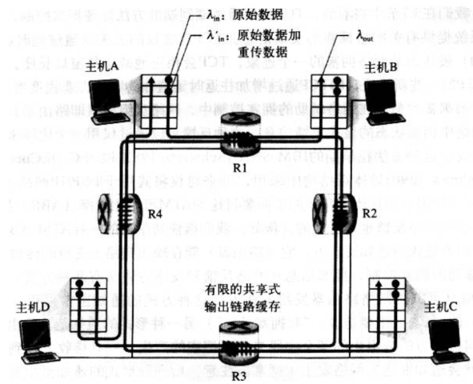
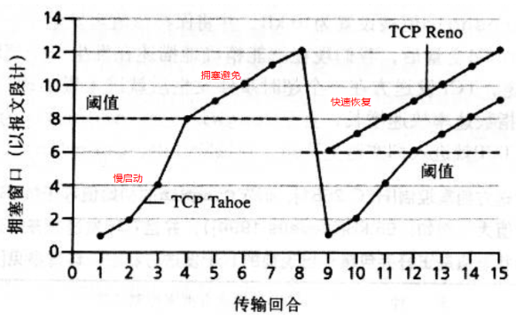

### 前言

前面写了一篇关于TCP/IP协议的文章，从为什么要有这个协议族到各个层中主要协议的应用依次进行了回顾，本篇博客主要针对传输层中的TCP协议进行深入剖析，一起揭开它的神秘面纱。之所以要将TCP单独拎出来讲讲，一是因为他在面试过程中出现的频率高，二则是因为它有很多有意思的机制值得我们去深入探讨，本文结合《计算机网络—自顶向下方法》，《TCP/IP详解卷一》以及一些优秀的博客，来谈谈自己对TCP相关机制的认识，若有不当之处，敬请见谅。

### 一、TCP的一些基本概念

- TCP是面向连接的。TCP在发送数据时，首先要做的就是建立连接，后面要提到的“三次握手”就是建立连接的过程，TCP在建立连接后才能发送数据，数据发送完毕后要释放连接。
- TCP协议只在端系统中运行，不在中间网络设备（路由器，链路交换机等）中运行，所以中间网络设备不会维持TCP的连接状态。这句话看似有点绕，但归结为一句话就是，TCP是运输层的协议，所以TCP的状态也仅在运输层上维持，而中间网络设备是没有运输层的（网络层，数据链路层，物理层）。
- TCP是全双工服务的。如果主机A和主机B建立了一条TCP连接，那么主机A可以向主机B发送数据，主机B也可以向主机A发送数据，也就是说通信双方都可以发送和接收数据。
- TCP是点对点连接的。就是说TCP是一对一建立连接，不存在一对多（多播）的情况。
- 发送缓存：无论接收方还是发送方，在建立TCP连接后都会配置一定大小的缓存。对发送方来说，应用层的数据首先进入缓存，TCP会从缓存中取数据进行发送；对接收方来说，TCP接收到的数据首先放入缓存，根据上层应用程序的需要从缓存中取出数据。
- TCP报文段：TCP报文由TCP首部和数据组成，也就是一个包含TCP相关状态，参数信息，待处理数据的集合包。对于发送端来说，运输层收到来自应用程序的数据，在数据的头部加上一段TCP特有首部，一并发给网络层；对接收端来说，运输层收到网络层的数据包，解析出TCP首部，更新TCP状态，将剩余数据传送给应用层。

### 二、TCP报文段

#### 1.TCP报文段的结构



TCP报文段如上图所示，主要由TCP首部和数据俩部分组成，数据没什么好说的，重点说一下TCP首部。

- TCP报文段首部的前20个字节是固定的，后面有4n个字节根据需要而增加，因此TCP首部的最小长度是20字节。
- 源端口号和目的端口号：各占俩个字节，TCP的分用功能是通过端口来实现
- 序号和确认号：各占4个字节，是TCP完成可靠传输的重要组成
- 首部长度：占4位，也称为数据偏移，它指出TCP报文段的数据起始处距离TCP报文段的起始处有多远，实际就是首部的长度，因为首部长度不固定，因此这个首部长度字段是必要的
- 6比特标志位（URG, ACK, PSH, RST, SYN, FIN）：这些标志位是在建立连接、关闭连接、传输数据等过程中起作用。URG用来指示被发送的数据是否为“紧急”数据，ACK用于数据传输和建立、关闭连接时的应答，PSH用来指示接收的数据是否要交给上层应用，RST、SYN、FIN用于建立和关闭连接
- 接收窗口：占2字节，表示接收方可以接受的字节数，主要用于流量控制
- 因特网校验和：检测数据是否完整传输，占2字节
- 紧急数据指针：指向紧急数据的最后一个字节，占2字节
- 选项：用于发送方与接收方写上最大报文段长度（MSS）时，或在高速网络环境下用作窗口调节因子时使用，这里的4n个字节是根据需要而增加的，最长为40个字节

注：最大报文长度（MSS）是每一个TCP报文段中的数据字段的最大长度，数据字段加上TCP首部才是整个TCP报文段。

#### 2.序号

TCP将数据看作是一个无结构，有序的字节流，TCP将字节流进行分组，每次发送一组或者多组，为了解决接收方可能会收到冗余的分组，TCP加入了序号字段。所谓序号就是对每个分组进行编号，分组的序号连续且唯一，这样发送和接收双方都能从序号得知要处理的分组。

比如有一段1000字节的数据，现将其分为10组，每组也就是100字节，其序号可表示为从0到9，这里是按照组的个数来表示的，也可以表明每个组中的字节数，如第一个分组可表示为000-099，第二个表示为100-199，以此类推，后续博客中将以分组数目来表示序号。

#### 3.确认号

确认号就是收到数据后，对数据检查，返回一个检查结果。比如主机A向主机B发送了一段序号为0的报文段，主机B收到该报文段后，若数据正确，则向主机A返回一个确认号为1的报文，表示报文0我已收到，下次请发送报文1，主机A收到这样的应答后，就会发送后续的数据给主机B。

### 三、TCP的可靠传输

所谓可靠传输就是确保要传输的数据能全部到达接收端，且被接收。可靠传输实际就是解决丢包问题，丢包问题主要有俩种情况：一种是报文段在发送过程中丢失，接收方没有收到；第二种是接收方收到了报文，但是确认报文在发送过程中丢包，导致发送方不知道接收方已收到报文。

#### 1.序列号和确认应答

数据到达接收方，接收方要发出一个确认应答，表示应经收到了该数据段，并且确认号会说明它下一次要接收的数据的序列号。

#### 2.超时重传

- 如果发送方迟迟未收到确认应答，那么可能是发送的数据丢失，也可能是确认应答丢失，这时发送方会在等待一定时间后会进行重传，这个时间一般是2*RTT（报文往返的时间）+偏差值。
- 在实现上，发送方每发送一段报文，就启动计时器，如果在有效间隔时间内收到来自接收方的确认报文段，就说明已经完成了一次报文段的发送，如果超过该时间都没有收到确认报文段，发送方就会认为数据出现丢包（不管是哪种丢包），会继续发送上一次未被确认的报文段。
- 超时间隔加倍：假定初始的超时间隔为0.75s（2*RTT），第一次出现超时重传后，该时间间隔将翻倍，也就是1.5s，以此类推，注意数据也不会被反复地重发，达到一定重发次数之后，如果仍没有任何确认应答返回，就会判断为网络或对端主机发生了异常，强制关闭连接。并且通知应用通信异常强行终止。这种设计是容易理解的，既然发生了重传，表明在传输过程中遇到了障碍，可能是网络拥塞，缓存溢出等等。超时间隔可以理解为一种拥塞控制，延长发送方的等待时间，等网络不那么拥塞后再传数据，可避免再次重传。
- 虽然超时重传保证了数据的可靠性，但是重传意味着占用TCP的资源，过多的重传必然会降低TCP的传输效率，因此TCP设置了其他机制来减少或者避免重传冗余数据。

#### 3.窗口控制与高速重发机制/快速重传（重复确认应答）

这是对超时重传的一个改进，超时重传要等发送的上一个数据收到确认应答后才进行后续数据的传送，不然发送端会一直等待，这严重降低了TCP的传输效率。TCP利用窗口控制来提高传输的效率，意思是在一个窗口内，不一定等到应答才能发送下一段数据，窗口大小就是无需等待确认而可以继续发送数据的最大值，如果没有窗口控制，每一个没收到应答的数据都要重发。



使用窗口控制，如果1001-2000丢失，后面数据的每次传输，确认应答都会不停地发送序号为1001的应答，表示我要接受1001开始的数据，若发送端收到3次相同的应答，就会立刻重发；还有一种情况，就是数据收到了，但是应答却丢失了，这种情况不会重发，因为发送端知道，如果数据丢了，那么接收端会疯狂给它提醒。

#### 4.回退N步、选择重传

我们先来设定一种情况：主机A发送了N组报文到主机B，其中第n组（n<N）报文丢失，其余N-1组报文都到达主机B。

- 回退N步（GBN）：重传第n、n+1、n+2...N组报文。
- 选择重传（SR）：重传第n组报文。

TCP使用的就是选择重传，避免了重传很多已经收到的报文，提升了效率。

### 四、TCP连接管理

TCP提供面向连接的通信传输，面向连接是指在数据通信开始前做好俩端之间的准备工作。

#### 1.“三次握手”建立连接

所谓三次握手就是指建立一个TCP连接时需要客户端和服务端总共发送三个包以确认连接的建立，在socket编程中，这一过程由客户端执行connect来触发，下面是可靠三次握手的具体过程：



- 第一次握手：客户端将标志位SYN置为1，随机产生一个seq=J，并将该数据包发送给服务器端，客户端进入SYN_SENT状态，等待服务器确认。
- 第二次握手：服务器端收到客户端发来的数据后，知道客户端请求建立连接，服务器端将标志位SYN和ACK同时置为1，ack=J+1，随机产生一个seq=K，并将该数据包发送给客户端以确认连接请求，服务器进入SYN_RCVD状态。
- 第三次握手：客户端收到服务器端的确认后，检查ack是否为J+1，ACK是否为1，如果正确则将ACK置为1，ack=K+1，并将该数据包发送给服务器端，服务器端检查ACK是否为1，ack是否为K+1，如果正确则连接成功建立，客户端和服务端进入ESTABLISHED状态，至此三次握手完成，随后客户端和服务器端之间进行数据传输。

**为什么要用“三次握手”来建立连接，俩次行不行？**

“已失效的连接请求报文段” 的产生在这样一种情况下：客户端发出的第一个连接请求报文段并没有丢失，而是在某个网络结点长时间的滞留了，以致延误到连接释放以后的某个时间才到达服务端。本来这是一个早已失效的报文段，但服务器端收到此失效的连接请求报文段后，就误认为是客户端再次发出的一个新的连接请求，于是就向客户端发出确认报文段，同意建立连接。假设不采用 “三次握手”，那么只要服务器端发出确认，新的连接就建立了。由于现在客户端并没有发出建立连接的请求，因此不会理睬服务器端的确认，也不会向服务器端发送数据。但服务器端却以为新的运输连接已经建立，并一直等待客户端发来数据。这样，服务器端的很多资源就白白浪费掉了。采用 “三次握手” 的办法可以防止上述现象发生。例如刚才那种情况，客户端不会向服务器端的确认发出确认。服务器端由于收不到确认，就知道客户端并没有要求建立连接。

TCP 需要 seq 序列号来做可靠重传或接收，而避免连接复用时无法分辨出 seq 是延迟或者是旧链接的 seq，因此需要三次握手来约定确定双方的 ISN（初始 seq 序列号） 。因为 sequence numbers（序列号）没有绑定到整个网络的全局时钟（全部统一使用一个时钟，就可以确定这个包是不是延迟到的）以及 TCPs 可能有不同的机制来选择 ISN（初始序列号）。 因此服务器端必须要跟客户端确认seq。

**为什么不用“四次握手”**

不用四次，本来握手和挥手的模型是一样的，需要俩个方向都能够联通，四次握手的模型应该是：

1.客户端发送seq0给服务器

2.服务器收到seq0，回复ack(seq0+1)

3.服务器发送seq1

4.客户端回复ack（seq1+1）

因为TCP是全双工的，上边的四步确认了数据在俩个方向上都是可以正确到达对面，但是2,3步没有上下联系，可以将其合并，这样可以加快握手的效率，所以就变成了三次握手。

#### 2.“四次挥手”断开连接

- 四次挥手即终止TCP连接，就是指断开一个TCP连接时，需要客户端和服务器端总共发送4个包以确认连接的断开。在socket编程中，这一过程由客户端或服务端任一方执行close来触发。
- 由于TCP连接是**全双工**的，因此，每个方向都必须要单独进行关闭，这一原则是当一方完成数据发送任务后，发送一个FIN来终止这一方向的连接，收到一个FIN只是意味着这一方向上没有数据流动了，即不会再收到数据了，但是在这个TCP连接上仍然能够发送数据，直到这一方向也发送了FIN。首先进行关闭的一方将执行主动关闭，而另一方则执行被动关闭。



先中断连接的可以是客户端也可以是服务器端，下面以客户端先中断连接为例说明

- 第一次挥手：客户端发送一个FIN=M，用来关闭客户端到服务器端的数据传送，客户端进入FIN_WAIT_1状态。意思就是“我客户端没什么数据要给服务器端了”，但如果你服务器端还有数据没有发送完成，则不用急着关闭连接，可以继续发送数据给我客户端。
- 第二次挥手：服务器端在接收到FIN后，发送一个ack=M+1,告诉客户端你的请求已经收到，但是我还没有准备好，请你继续等待我的消息，这时客户端进入FIN_WAIT_2状态，继续等待服务器端的FIN报文。
- 第三次挥手：当服务器端的数据发送完毕，则向客户端发送一个FIN=N的报文，告诉客户端，我已经把数据发完了，可以关闭连接了，服务器端进入LAST_ACK状态。
- 第四次挥手：客户端收到FIN=N的报文后，就知道可以关闭连接了，但是它还是不太相信网络，怕服务器不知道要关闭，所以发送ack=N+1报文，进入TIME_WAIT状态，如果服务器端没有收到ACK可以重传。服务器收到ACK后，就可以断开连接了，客户端等待2MSL后依然没有收到回复，则证明服务器端已经正常关闭，那么客户端也可以关闭了，最终完成了四次握手。

#### 3.SYN洪泛攻击

我们发现当服务器端接收到来自客户端的建立连接的请求后，没有经过第三次握手就已经为该条TCP分配好了缓存和变量，这为那些网络攻击者提供了漏洞：攻击者不停地发送建立连接的请求，但是并不进行第三次握手，这就导致服务器端一直在分配资源，但是一条TCP都没有建立，服务器的资源将被耗尽，这就是SYN洪泛攻击。

一种有效的防御手段为SYN cookie，其设计原理是：既然之前分配资源是在第三次握手之前，现在不妨将资源分配放在第三次握手成功后，再进行资源的分配。具体的实施方式：服务器在收到一个建立连接的请求（可能来自客户端，可能是SYN洪泛攻击），在确认报文中，生成一个初始的TCP序列号，这个序列号是根据源IP地址，端口号和目的IP地址，端口号以及仅有该服务器知道的秘密数组成的一个复杂函数生成的，这个序列号称为cookie。需要注意的是，服务器并不记录该cookie或任何对应于SYN的其他状态信息，这样做是为了保证后续验证阶段的可靠性。如果客户是合法的，则返回一个ACK报文段，服务器验证该报文段，也就是用生产序列号结合客户端发送来的源IP地址，端口号生成一个序列号，再加上1，如果和ACK报文段的确认号相同，就说明这条建立连接的请求是合法的，这样做即使这个建立连接的请求是非法的，对服务器来说并没有什么损害，因为并没有为此分配资源。

### 五、流量控制

所谓流量控制就是让发送方的发送速率不要太快，让接收方来得及接受。利用滑动窗口机制可以很方便的在TCP连接上实现对发送方的流量控制，注意TCP滑动窗口的单位是字节，不是报文段，发送方的发送窗口不能超过接收方给出的接收窗口的数值。

```
滑动窗口知识点总结：
1.什么是滑动窗口？
滑动窗口是一个类似于窗口一样的东西，用来告诉发送端可以发送数据的大小或者说是窗口标记了接收端缓冲区的大小，滑动窗口指的是一次批量的发送多少数据。
2.为什么会出现滑动窗口？
在确认应答策略中，对每一个发送的数据段，都要给一个ACK的确认应答，发送端收到该确认报文后才能发送后续数据，这样做虽然可以保证可靠传输，但是有一个较大的缺点，就是性能差，尤其是数据往返的时间长的时候。使用滑动窗口，就可以一次发送多条数据，从而提高了性能。
3.滑动窗口的一些特点
（1）接收端将自己可以接收的缓冲区大小放入TCP首部中的“窗口大小”字段，通过ACK来通知发送端
（2）窗口大小字段越大，说明网络的吞吐率越高
（3）窗口大小指的是无需等待确认应答而可以继续发送数据的最大值，即就是说不需要接收端的应答，可以一次连续的发送数据
（4）操作系统内核为了维护滑动窗口，需要开辟发送缓冲区，来记录当前还有那些数据没有应答，只有确认应答过的数据，才能从缓冲区删掉
ps：发送缓冲区如果太大，就会有空间开销
（5）滑动窗口中有俩种数据类型，一种是已发送，还没收到确认的，第二种是可以发送，但是还没发送的
```

流量控制实际就是保证接收方缓存有余量的情况下发送方发送数据，对于这个问题有俩点疑问，一是如何控制发送方发送的流量，二是如何知道接收方是否还有缓存余量，对于这俩个问题我们要深入探讨一下。

- 如何控制发送方流量？TCP是通过让发送方维护一个接收窗口（rwnd）的变量来进行流量控制，每次发送方发送数据的值不会超过该窗口的值，接收窗口是动态变化的，具体如何变化见下一个问题。
- 如何知道接收方的缓存余量？上面我们提到接收窗口是动态变化的，那是如何变化的呢？接收方把当前接收窗口（rwnd）的值放入它发给发送方的报文段中（放在拥有16位的接受窗口处），通知发送方还有自己还有多少可用空间。

接受窗口的大小是如何确定的？定义俩个变量：

LastByteRead:接收方上层的应用进程从缓存中读出的数据流的最后一个字节的编号

LastByteRcvd:接收方缓存中已接收数据流的最后一个字节的编号



上图所示是一个接收方缓存的示意图，TCP要求不允许缓存溢出，上图整个蓝色条是接收方已经接受到的数据，它是小于等于接收方缓存的，其中前半段是已经读取的数据，后半段是还未读取的数据，由上图可得接收窗口的计算公式：


$$
rwnd=RcvBuffer-(LastByteRcvd-LastByteRead)
$$
其中，rwnd是接收窗口的大小，RcvBuffer是接收方的缓存大小。

接收端一旦发现自己的缓冲区快满了，就会将窗口大小设置成一个更小的值通知给发送端，发送端收到这个值后，就会减慢自己的发送速度；如果接收端发现自己的缓冲区满了，就会将窗口的大小设置为0，此时发送端将不再发送数据，但是需要定期发送一个窗口探测数据段（数据为一个字节），使接收端把窗口大小告诉发送端。

### 六、拥塞控制

所谓拥塞控制就是防止发送方发的太快，使得网络来不及处理，从而导致网络拥塞。下面结合《计算机网络--自顶向下方法》简单分析一下为何会出现网络拥塞以及它的代价是什么。

#### 1.出现网络拥塞的几种情况

情况1：两个发送方和一台具有无穷大缓存的路由器，主机向路由器提供流量的速率单位字节/秒。假设两条TCP连接的总吞吐量为R，那么当每条连接的发送速率在0~R/2时，两条TCP都能无拥塞的流通。我们可能会说把速率设置为R/2就可以最大化传输效率，但是实际情况是，这种做法的平均时延会越来越大，所以说这种做法不一定好。如果某条TCP连接的传送速率大于R/2，那么主机C和D就接收不过来了，这时候，数据就会先被保存在路由器的缓存中，待接收端处理完后再从缓存取出。由于我们一开始就假设主机会一直增加发送速率，那么就会有越来越多的数据被存入缓存，也就意味着位于缓存的数据“等待”时间会越来越长，直至无限长（因为我们的缓存是无穷大的）。这就出现了一种拥塞代价：当分组的到达速率接近链路容量时，分组经历巨大的排队时延。



情况2：两个发送方和一台具有有限缓存的路由器。基本设置和情况1一样，唯一的区别是，现在路由器的缓存不再是无穷大了，而是有一定大小。这样的话，随着到达速率越来越大，缓存渐渐的被占满，一旦缓存没有剩余容量了，以后到达的数据就会被丢弃，就出现了丢包情况。我们知道，一旦出现丢包，TCP就会有超时重传，这样就造成带宽流量的占用。这就出现了第二种拥塞代价：发送方必须以重传作为缓存溢出而导致数据丢包的补偿。

当然，还有可能出现另外一种情况：发送方的数据因为在缓存中等待时间太长了，所以发送方选择重传，但是重传的数据仍然有可能被存放在缓存中，那么缓存中就出现了两条相同的报文，在一定时间，两条数据都会被路由器传送到接收端，对于接收端来说，就收到了冗余报文段。这就出现了第三种拥塞代价：发送方在遇到大时延时所进行的不必要重传会引起路由器利用其链路带宽来转发不必要的分组副本。



情况3：4个发送方和具有有限缓存的多台路由器及多跳路径。也就是发送方要经过多个路由器才能到达接收方，比如主机A要经过R1和R2才能到达主机C，而主机B要经过R2和R3才能到达主机D，它们有一个共同的中间路由。那么问题来了，假设R1的缓存没有满，而R2的缓存满了，来自主机A的数据先要占用一部分R1的带宽，然后从R1传送到R2，却发现R2缓存满了，那么这个数据就会被丢失。虽然和情况2一样最终结果都是数据丢失了，但是对于这种情况，该丢失的数据还占用了R2之前的所有路由带宽，造成了不必要浪费。这就出现了第四种拥塞代价：当一个分组沿一条路径被丢弃时，每个上游路由器用于转发该分组到丢弃该分组而使用的传输容量最终被浪费掉了。



#### 2.拥塞控制的方法

- 端到端拥塞控制。由于网络层没有为运输层拥塞控制提供显示支持，即使网络中存在拥塞，端系统也必须通过对网络行为的观察（丢包，时延）来推断。
- 网络辅助的拥塞控制。路由器向发送方提供关于网络中拥塞状态的显示反馈信息。

#### 3.TCP拥塞控制

TCP采用的是端到端的拥塞控制，运行在发送方的TCP拥塞控制机制维护一个拥塞窗口（cwnd），它可以限制发送方向网络中发送流量的速率。TCP拥塞控制算法主要包括三个部分：慢开始，拥塞避免，快速恢复。

- 慢启动：首先将拥塞窗口设置为一个MSS大小，如果第一次发送数据成功并收到应答，则将拥塞窗口的大小乘2，第二次成功发送数据后，将拥塞窗口再次翻倍，以此类推。拥塞窗口的大小不会一直成倍增长，到达慢开始门限（ssthresh）后，进入拥塞避免阶段。
- 拥塞避免：进入该模式后，拥塞窗口不再成倍增长，因为此时离网络拥塞已经很接近了。此时每经过一个往返时间（RTT），就将拥塞窗口加一，拥塞窗口呈线性增长，一旦发现网络拥塞（超时），将再次执行慢开始算法，其中慢开始门限为此时拥塞窗口的一半，拥塞窗口的大小也变为1；有时个别报文段在网络中丢失，也发生了超时现象，但网络其实并不是很拥堵，比如发送方一连收到三个重复的ACK确认，就知道接收方没有收到某一报文段，此时会立即进行重传，并执行快恢复算法。
- 快速恢复：进入快恢复阶段，将拥塞窗口的大小设为当前窗口的一半，同时将慢开始门限也设为当前窗口的一半，也即调整后的窗口大小与调整后的慢开始门限相等，并执行拥塞避免算法。注意，有的快恢复算法会将拥塞窗口的值调的更大一些，即等于调整后的慢开始门限值（ssthresh）+3*MSS，这样做的理由是：既然发送方已经收到3个重复的确认，就表明有三个分组已经离开网络这三个分组不再消耗网络资源，因此可以适当增大拥塞窗口。




